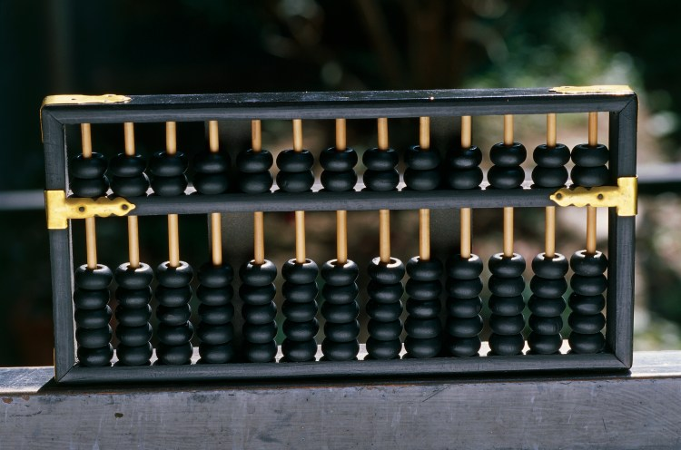
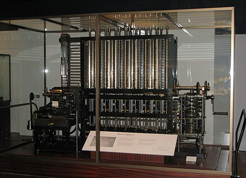
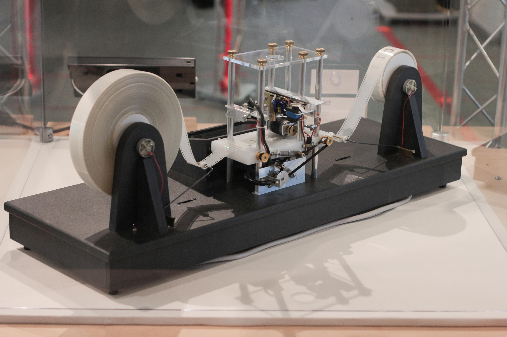
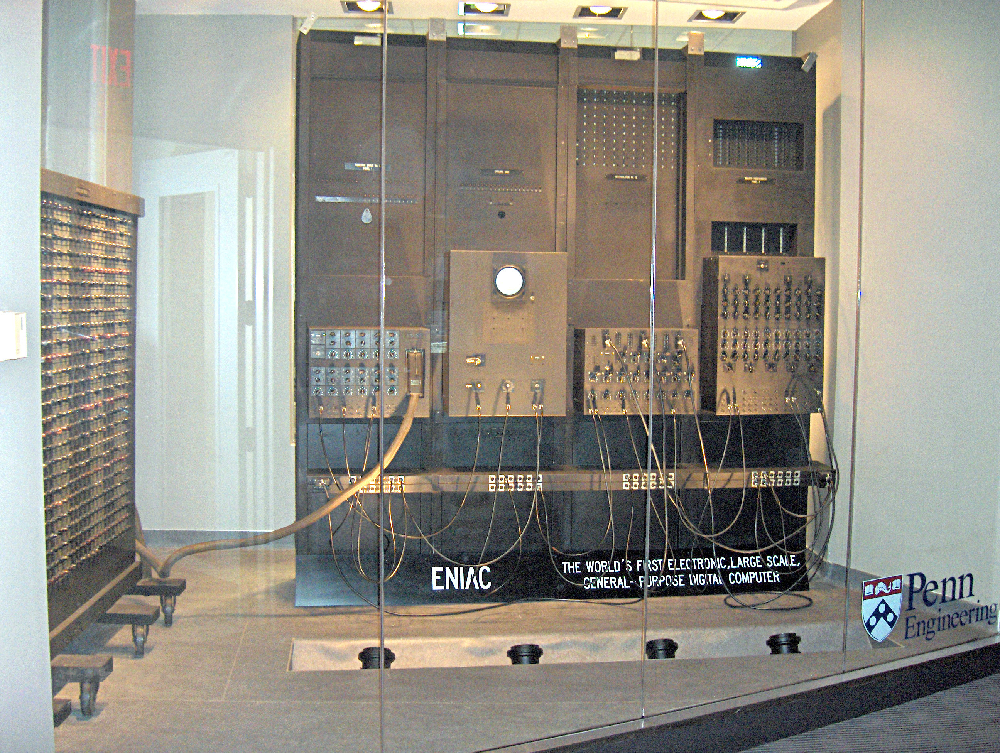

<!-- _class: lead -->
<!-- _paginate: false -->

# ¿Qué es un computador?
## Del ábaco al silicio

*Semana 1 · Introducción a la Programación y Análisis de Datos*

*Horacio Samaniego* · *horaciosamaniego@uach.cl*

*Laboratorio de Ecoinformática*
*Instituto de Conservación, Biodiversidad y Territorio*
*Universidad Austral de Chile · UACh*

---

<!-- _class: pregunta -->

# 🤔 ¿Es una calculadora un computador? ¿Y un termostato? ¿Y un cerebro?

*No respondan aún — al final de la clase debieramos tener una definición + precisa.*

---

# Hoja de ruta

1. **Historia** — De dónde vienen los computadores
2. **Anatomía** — Cómo funcionan por dentro
3. **Definición** — Qué significa "computar"
4. 🧪 **Laboratorio** — Ustedes *son* el computador

---

<!-- _class: invert -->

# Historia de la computación
## Cinco estaciones, cinco mil años

---

# 🧮 Estación 1 · El ábaco (~3000 a.C.)

Herramienta de cálculo más antigua **aún en uso**.

Cuentas en varillas representan cantidades por **posición**.

> **Principio:** Los datos necesitan un **soporte físico** para ser manipulados. Sin representación, no hay cálculo.

 

💬 *¿Por qué no basta con contar con los dedos?*


---

# ⚙️ Estación 2 · Babbage y Lovelace (1830s)

**Charles Babbage**
- *Máquina Diferencial* — calcula tablas automáticamente
- *Máquina Analítica* — **programable** con tarjetas perforadas

**Ada Lovelace** — primera programadora de la historia. Escribió algoritmos para una máquina que nunca se construyó.

> **Principio:** Separación entre **datos** e **instrucciones**. Nace la idea de *programa*.

  .jpg)

---

# 💡 Estación 3 · Alan Turing (1936)

Demostró que una máquina muy simple — una cinta y unas reglas — puede computar **todo** lo computable.

> **Principio:** La computación no depende del material, depende de la **lógica**.

💬 *¿Se puede computar con papel y lápiz?*

Sí. Y hoy lo van a hacer. *(Lo formalizamos en la Semana 5.)*



---

# 🔌 Estación 4 · ENIAC (1945)

- **30 toneladas**, 18.000 tubos de vacío
- Programado reconectando cables físicamente
- Las "computadoras" eran **personas** (mayoritariamente mujeres)

> **Principio:** Velocidad. La electrónica hace lo mismo que el ábaco, pero **miles de millones** de veces más rápido.



---

# 📱 Estación 5 · Del microprocesador a tu bolsillo

- **Intel 4004** (1971): primer microprocesador comercial
- **Ley de Moore:** densidad de transistores se duplica ~cada 2 años *(observación empírica, ya llegando a sus límites)*
- Tu teléfono > todas las máquinas del programa Apollo

> **Principio:** Miniaturización y accesibilidad.

---

# Resumen: línea temporal

| Época | Hito | Principio clave |
|---|---|---|
| ~3000 a.C. | Ábaco | Representación física |
| 1830s | Babbage / Lovelace | Datos ≠ instrucciones |
| 1936 | Turing | Computación = lógica |
| 1945 | ENIAC | Velocidad electrónica |
| 1971–hoy | Microprocesador → smartphone | Acceso universal |

---

<!-- _class: invert -->

# Anatomía de un computador
## Capas y componentes

---

# Capas de abstracción

```
┌───────────────────────────────────┐
│         Aplicaciones              │  ← lo que ves
│    (navegador, Excel, Python)     │
├───────────────────────────────────┤
│       Sistema Operativo           │  ← administrador
│    (Linux, Windows, macOS)        │
├───────────────────────────────────┤
│          Hardware                 │  ← lo físico
│   (CPU, RAM, disco, pantalla)     │
└───────────────────────────────────┘
```

> **Analogía ecológica:** Niveles de organización biológica — no se entiende un ecosistema mirando solo las moléculas, pero las moléculas lo *sostienen*.

---

# Componentes: la cocina del restaurante 🍳

| Componente | Función | Analogía |
|---|---|---|
| **CPU** | Ejecuta instrucciones y cálculos | El chef: sigue la receta |
| **RAM** | Almacenamiento rápido, temporal | La mesada: lo que hay a mano |
| **Disco / SSD** | Almacenamiento permanente | La despensa |
| **E/S** | Comunicación con el exterior | La ventanilla |

**Dentro de la CPU:**
- **ALU** — operaciones matemáticas y comparaciones
- **Unidad de Control** — lee instrucciones y coordina

---

<!-- _class: pregunta -->

# 🤔 ¿Qué pasa si el chef es rapidísimo pero la mesada es diminuta?

*Cuello de botella. La velocidad depende del componente más lento.*

---

<!-- _class: invert -->

# ¿Qué significa "computar"?

---

# Definición operativa

> **Computar** = transformar una **entrada** en una **salida** mediante un **procedimiento definido** (algoritmo), en un número **finito** de pasos.

El procedimiento debe ser **tan preciso** que cualquiera que lo siga — persona, máquina, o extraterrestre — obtenga el **mismo resultado**.

Eso distingue un **algoritmo** de una **intuición**.

---

# Tres ejemplos

**1. Sumar dos números**
Entrada: (3, 5) → Procedimiento: suma → Salida: 8

**2. Ordenar especies por abundancia**
Entrada: lista desordenada → Procedimiento: ordenamiento → Salida: lista ordenada

**3. ¿Califica como área protegida?**
Entrada: biodiversidad, superficie, amenazas → Procedimiento: criterios UICN → Salida: sí/no + categoría

---

# Tres preguntas fundamentales

Nos acompañarán todo el semestre:

| Pregunta | Significa | Cuándo |
|---|---|---|
| **¿Es computable?** | ¿Existe procedimiento finito? | Sem. 5: Turing |
| **¿Qué tan difícil es?** | ¿Cuántos pasos? ¿Escala? | Sem. 4: Complejidad |
| **¿Cómo lo expreso?** | ¿En qué lenguaje? | Sección 2: Python |

> **Analogía:** *(1) ¿Se puede restaurar este ecosistema? (2) ¿Cuánto costará? (3) ¿Qué herramientas usaré?*

---

# Volvamos a la pregunta inicial

**¿Es una calculadora un computador?**
No en sentido estricto: operaciones fijas, **no programable**.

**¿Un termostato programable?**
Sí — cumple la definición mínima.

**¿Un cerebro?**
Pregunta abierta. Pero si Church-Turing tiene razón y el cerebro computa... una Máquina de Turing podría simularlo.

---

<!-- _class: lead -->

# 🧪 Laboratorio analógico
## "El Computador Humano"

*Ahora ustedes son el computador. Literalmente.*

---

<!-- _class: lab -->

# Reglas del juego

- Grupos de **5 personas**
- Cada persona es un **componente** del computador
- El/la Programador/a escribe instrucciones en tarjetas
- Los demás ejecutan **al pie de la letra**

**Sin interpretar. Sin asumir. Sin improvisar.**

Si la instrucción es ambigua → el computador **falla** 💥

---

<!-- _class: lab -->

# Los 5 roles

| Rol                     | Función clave                                            |
| ----------------------- | -------------------------------------------------------- |
| 🟦 **Programador/a**     | Escribe instrucciones. **En silencio** durante ejecución |
| 🟩 **Unidad de Control** | Lee tarjetas y coordina. No calcula ni almacena          |
| 🟨 **ALU**               | Calcula (+−×÷). **No recuerda** resultados previos       |
| 🟧 **Memoria**           | Guarda/entrega datos en 10 celdas (0–9)                  |
| 🟥 **E/S**               | Lee datos de entrada, escribe salida en pantalla         |

---

<!-- _class: lab -->

# Instrucciones permitidas

| Instrucción                        | Qué hace                      |
| ---------------------------------- | ----------------------------- |
| LEER_ENTRADA → celda X             | Dato de entrada → celda X     |
| GUARDAR valor → celda X            | Valor fijo → celda X          |
| LEER celda X                       | Anuncia contenido de celda X  |
| OPERAR celda X ○ celda Y → celda Z | Calcula X ○ Y, resultado en Z |
| ESCRIBIR_SALIDA celda X            | Valor de celda X → pantalla   |

**⚠️ Una instrucción por tarjeta. Numerar cada tarjeta.**

---

<!-- _class: lab -->

# Ronda 1 · Densidad poblacional

**Datos de entrada:**
- Dato 1: `150` (individuos contados)
- Dato 2: `30` (hectáreas muestreadas)

**Resultado esperado:** `5.0` *(densidad = 150 ÷ 30)*

| Paso                                                     | Tiempo |
| -------------------------------------------------------- | ------ |
| Programación (grupo discute, solo Programador/a escribe) | 5 min  |
| Ejecución (Programador/a en silencio)                    | 10 min |
| Verificación (¿pantalla dice 5.0?)                       | 5 min  |

---

<!-- _class: lab -->

# Ronda 2 · Abundancia relativa

**Datos de entrada:**
- Dato 1: `45` (individuos especie A)
- Dato 2: `75` (individuos especie B)

**Resultado esperado en pantalla:**
- `120` — total
- `0.375` — proporción especie A
- `0.625` — proporción especie B

| Paso         | Tiempo |
| ------------ | ------ |
| Programación | 8 min  |
| Ejecución    | 10 min |
| Verificación | 7 min  |

---

<!-- _class: lab -->

# 🪤 Ronda 2 — La clave

Este problema necesita un **resultado intermedio**: el total.

Deben **guardar la suma en una celda** antes de dividir.

La ALU **no tiene memoria** — si no guardan el resultado, **se pierde**.

---

<!-- _class: lab -->

# 🚀 Extensión (grupos avanzados)

**Nueva instrucción:**

`SI celda X > valor → tarjeta N, SINO → tarjeta M`

**Problema:**
- Si densidad < 1.0 ind/ha → escribir **"ESPECIE EN RIESGO"**
- Si no → escribir **"POBLACIÓN ESTABLE"**

¿Pueden programar esto con tarjetas?

---

<!-- _class: invert -->

# Discusión entre todos

---

<!-- _class: pregunta -->

# ¿Qué fue lo más difícil?

---

<!-- _class: pregunta -->

# ¿Qué pasó cuando una instrucción era ambigua?


---

<!-- _class: pregunta -->

# ¿Qué pasó cuando una instrucción era ambigua?

*El sistema se detuvo o dio un resultado incorrecto. Un computador real hace exactamente lo mismo.*

---

<!-- _class: pregunta -->

# ¿La Memoria necesitó "entender" los números?


---

<!-- _class: pregunta -->

# ¿La Memoria necesitó "entender" los números?

*No. Solo los almacenó y entregó. Los computadores no "entienden" los datos.*

---

<!-- _class: pregunta -->

# ¿Qué paralelo ven con su trabajo en conservación?

*Los datos no hablan solos. El análisis depende de las instrucciones. Si el método es impreciso, los resultados no son confiables.*

---

<!-- _class: pregunta -->

# ¿Quién fue el componente más importante?


---

<!-- _class: pregunta -->

# ¿Quién fue el componente más importante?

*Ninguno funciona sin los demás. Un computador es un **sistema**.*

---

# Lo que aprendimos 

- **Computar** = transformar entradas en salidas con un procedimiento finito y preciso
- Los computadores **no piensan** — siguen instrucciones
- La **precisión** en las instrucciones no es opcional
- Todo computador tiene los mismos componentes: CPU, memoria, E/S
- La inteligencia está en quien **escribe las instrucciones**

---

# Próxima semana

## Semana 2 · Hablando en ceros y unos
### Binario, codificación y representación

*¿Cómo representa un computador texto, imágenes y sonido usando solo 0 y 1?*

**Traer:** lápices o cuentas de **dos colores** distintos 🟢⚪

---

<!-- _class: lead -->
<!-- _paginate: false -->

# ¿Preguntas?

*Semana 1 · ¿Qué es un computador? Del ábaco al silicio*
