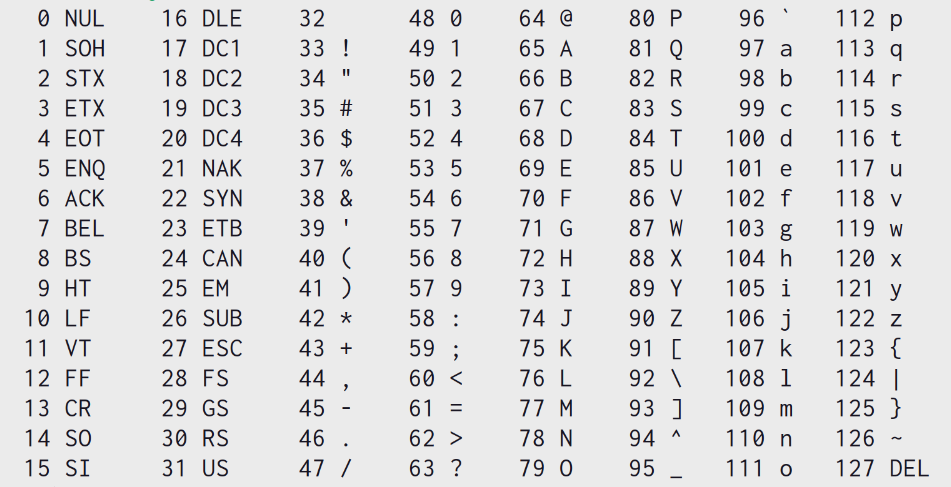

<!-- _class: lead -->
<!-- _paginate: false -->

# Hablando en ceros y unos
## Binario, codificación y representación

*Semana 2 · Introducción al Análisis de Datos y Programación*

Horacio Samaniego *(horaciosamaniego@uach.cl)*

*Laboratorio de Ecoinformática · Instituto de Conservación, Biodiversidad y Territorio*
*Valdivia, UACh*

2026
---

# Recuerdo de la Semana 1

La semana pasada:
- La **Memoria** almacenaba "valores" en celdas
- La **ALU** operaba con "números"

Hoy respondemos: **¿cómo se almacenan esos valores físicamente?**

---

# Hoja de ruta

1. **Truco** — Las cartas binarias
2. **Sistemas numéricos** — Decimal, binario, hexadecimal
3. **Texto** — ASCII y UTF-8
4. **Imágenes** — Píxeles y RGB
5. **Sonido** — Muestreo
6. 🧪 **Laboratorio** — Pulseras binarias
7. 📝 **Control 1**

---

<!-- _class: invert -->

# 🃏 El truco de las cartas binarias

---

# Las 5 cartas

```
Carta 1:  16 puntos  ●●●●●●●●●●●●●●●●
Carta 2:   8 puntos  ●●●●●●●●
Carta 3:   4 puntos  ●●●●
Carta 4:   2 puntos  ●●
Carta 5:   1 punto   ●
```

Un voluntario piensa un número del **0 al 31**.
El curso voltea las cartas para representarlo.
Yo adivino.

---

# El secreto: potencias de 2

Cada carta = una **potencia de 2**.
Cara arriba = **1**, cara abajo = **0**.

**Ejemplo:** el número **19**
- 16 ✅ + 8 ❌ + 4 ❌ + 2 ✅ + 1 ✅
- Cartas: arriba, abajo, abajo, arriba, arriba
- En binario: `10011`

> Esto es **exactamente** lo que hace la memoria de un computador. Cada celda: encendida o apagada.

---

<!-- _class: invert -->

# Sistemas numéricos
## Decimal, binario, hexadecimal

---

# El sistema decimal (base 10)

Lo que ya saben — 10 símbolos: **0 1 2 3 4 5 6 7 8 9**

Cada posición = una **potencia de 10**:

`347 = 3×10² + 4×10¹ + 7×10⁰ = 300 + 40 + 7`

> No tiene nada de especial. Lo usamos porque tenemos 10 dedos.

---

# El sistema binario (base 2)

Dos símbolos: **0** y **1**

Cada posición = una **potencia de 2**:

| Posición  | 8   | 7   | 6   | 5   | 4   | 3   | 2   | 1   | 0   |
| --------- | --- | --- | --- | --- | --- | --- | --- | --- | --- |
| **Valor** | 256 | 128 | 64  | 32  | 16  | 8   | 4   | 2   | 1   |

- 1 bit = un dígito binario (0 o 1)
- **8 bits = 1 byte**
- 1 byte puede representar 256 valores (0–255)

---

# Conversión: binario → decimal

Sumar las posiciones donde hay un 1:

`10110 = 1×16 + 0×8 + 1×4 + 1×2 + 0×1`
`     = 16 + 4 + 2 = 22`

**Ejercicio rápido:**
`11001` = ?

--

`11001 = 16 + 8 + 1 = 25` ✅

---

# Conversión: decimal → binario

**Método de la resta** — ir de la potencia más grande a la más pequeña:

Convertir **45** a binario:
- ¿128? No → 0. ¿64? No → 0. ¿32? Sí → resta 13 → **1**
- ¿16? No → 0. ¿8? Sí → resta 5 → **1**
- ¿4? Sí → resta 1 → **1**. ¿2? No → 0. ¿1? Sí → **1**

Resultado: `00101101`

**Ejercicio:** convertir **13** a binario

--

`13 = 8 + 4 + 1 = 00001101` ✅

---

<!-- _class: pregunta -->

# 🤔 ¿Por qué binario?

*Un transistor tiene dos estados: conduce o no conduce. Un cable tiene voltaje alto o bajo. Con solo dos estados se minimiza el error por ruido eléctrico.*

*Es como clasificar hábitat en presente/ausente en vez de una escala 1–10: más tosco, pero mucho más robusto.*

---

# Hexadecimal (base 16) — versión compacta

16 símbolos: **0–9** y **A–F** (A=10, B=11, ..., F=15)

Cada dígito hex = exactamente **4 bits**:

| Hex | Bin  | Dec |     | Hex | Bin  | Dec |
| --- | ---- | --- | --- | --- | ---- | --- |
| 0   | 0000 | 0   |     | 8   | 1000 | 8   |
| 5   | 0101 | 5   |     | A   | 1010 | 10  |
| 7   | 0111 | 7   |     | F   | 1111 | 15  |

**Ejemplo:** `FF` = `11111111` = **255**

Se usa en: colores web, direcciones de memoria, redes.

---

# Hexadecimal en la vida real

El color blanco en una página web:

`#FFFFFF` = tres bytes: `FF` `FF` `FF`

= Rojo **255**, Verde **255**, Azul **255**

*(Más sobre esto en unos minutos.)*

---

<!-- _class: invert -->

# Representando texto
## ASCII y UTF-8

---

# El problema

Un computador **solo almacena números** (secuencias de bits).

Para almacenar texto, necesitamos un **acuerdo**:
¿qué número corresponde a qué letra?

Ese acuerdo se llama **codificación de caracteres**.

---

# ASCII (1963)

**American Standard Code for Information Interchange**

- 7 bits → **128 caracteres** posibles (0–127)
- Letras, dígitos, signos, caracteres de control

| Carácter   | Decimal | Binario  |
| ---------- | ------- | -------- |
| A          | 65      | 01000001 |
| B          | 66      | 01000010 |
| Z          | 90      | 01011010 |
| a          | 97      | 01100001 |
| 0 (dígito) | 48      | 00110000 |
| espacio    | 32      | 00100000 |

---

# ASCII (1963)




---

# Un detalle elegante

Entre **'A'** (65) y **'a'** (97) hay exactamente **32** de diferencia.

32 = 2⁵ → basta cambiar **un solo bit** (el bit 5) para pasar de mayúscula a minúscula.

```
A = 01000001
a = 01100001
       ↑ este bit
```

No es casualidad — es diseño inteligente.

---

<!-- _class: pregunta -->

# 🤔 ¿Qué pasa con la ñ? ¿Y con los acentos?

*No están en ASCII. ASCII fue diseñado para el inglés.*

---

# UTF-8 — el estándar universal

- **Unicode:** catálogo de ~150.000 caracteres (todos los idiomas, emojis, símbolos)
- **UTF-8:** la codificación más usada en internet
- Usa **1 a 4 bytes** por carácter
- Los primeros 128 = idénticos a ASCII (compatible)

Ejemplos: ñ = 241, á = 225, 🌳 = U+1F333 (4 bytes)

> Cuando ven **"ñ"** en vez de **"ñ"** en una web, es un error de codificación — el navegador usó la tabla equivocada.

---

<!-- _class: invert -->

# Representando imágenes
## Píxeles y RGB

---

# ¿Qué es una imagen digital?

Una **grilla de puntos** (píxeles). Cada píxel tiene un color.

**Resolución** = ancho × alto
Ejemplo: 1920 × 1080 = ~2 millones de píxeles

*(Demostración: hacer zoom a una foto hasta ver los píxeles.)*

> Toda foto, por hermosa que sea, es en el fondo una **tabla de números**.

---

# Color RGB

Cada píxel = **3 valores**: Rojo, Verde, Azul

Cada canal: **1 byte** (0–255). Total: **3 bytes = 24 bits** por píxel.

| Color | R | G | B | Hex |
|---|---|---|---|---|
| Negro | 0 | 0 | 0 | #000000 |
| Blanco | 255 | 255 | 255 | #FFFFFF |
| Rojo puro | 255 | 0 | 0 | #FF0000 |
| Verde bosque | 27 | 94 | 32 | #1B5E20 |
| Azul océano | 21 | 101 | 192 | #1565C0 |

Colores posibles: 256³ = **16.777.216**

---

# ¿Cuánto pesa una foto?

Foto de **12 megapíxeles** sin comprimir:

12.000.000 píxeles × 3 bytes = **36 MB**

Por eso existen JPEG y PNG: **compresión**.

> **Conexión ecológica:** las imágenes satelitales (Landsat, Sentinel) son lo mismo — grillas de píxeles. Pero con más canales: infrarrojo cercano, infrarrojo de onda corta... Clasificar uso de suelo es clasificar patrones de números en una tabla gigante.

---

<!-- _class: invert -->

# Representando sonido
## Muestreo y cuantización

---

# Del aire a los bits

El sonido es una **onda continua** (presión del aire).

Para digitalizarlo:
1. **Muestreo:** medir la amplitud a intervalos regulares
2. **Cuantización:** convertir cada medición en un número

**Parámetros clave:**
- **Frecuencia de muestreo:** CD = 44.100 Hz (44.100 mediciones/segundo)
- **Profundidad de bits:** CD = 16 bits (65.536 niveles posibles)

> **Ecología:** el monitoreo acústico de biodiversidad (AudioMoth) hace esto. Un AudioMoth a 48 kHz / 16 bits genera ~5 MB por minuto.

---

<!-- _class: invert -->

# Todo es bits
## El resumen

---

# Todo es convención

| Dato | Codificación | Estándar |
|---|---|---|
| Números | Posicional binario | Complemento a 2, IEEE 754 |
| Texto | Carácter → número → bits | ASCII, UTF-8 |
| Imágenes | Píxel → 3 números (RGB) → bits | JPEG, PNG |
| Sonido | Muestras → números → bits | WAV, MP3 |

El hardware solo distingue **dos estados**.

**Todo lo demás es un acuerdo humano** sobre cómo interpretar las secuencias de bits. Sin el acuerdo, los bits no significan nada.

---

# Unidades de información

| Unidad | Equivalencia | Ejemplo |
|---|---|---|
| 1 bit | 0 o 1 | Una respuesta sí/no |
| 1 byte | 8 bits | Un carácter ASCII |
| 1 KB | ~1.000 bytes | Un párrafo de texto |
| 1 MB | ~1.000 KB | Una foto JPEG |
| 1 GB | ~1.000 MB | ~250 canciones MP3 |
| 1 TB | ~1.000 GB | ~500 horas de video |

---

<!-- _class: lead -->

# 🧪 Laboratorio analógico
## "Pulseras Binarias"

*Vamos a escribir nuestras iniciales en el código más antiguo de la informática.*

---

<!-- _class: lab -->

# Convención

```
🟢 cuenta oscura / cuadro coloreado = 1   (encendido)
⚪ cuenta clara  / cuadro vacío     = 0   (apagado)
```

Cada letra = **8 bits (1 byte)**

Se lee de **izquierda a derecha** (bit 7 → bit 0).

---

<!-- _class: lab -->

# Fase 1 · Codificación (20 min)

**Tarea:** codifica tus **dos iniciales** (nombre + apellido) en binario.

1. Busca cada inicial en la **tabla ASCII** → número decimal
2. Convierte decimal → binario de **8 bits**
3. Colorea los cuadros en el papel (o ensarta cuentas)

**Ejemplo:** "H" = 72 = `01001000`, "P" = 80 = `01010000`

⚠️ **Siempre 8 bits.** No olviden los ceros a la izquierda.

---

<!-- _class: lab -->

# Fase 2 · Intercambio (15 min)

**Tarea:** intercambia tu hoja/pulsera con un compañero de **otro grupo**. Decodifica sus iniciales.

1. Lee los cuadros → escribe la secuencia de 0s y 1s
2. Separa en **dos bytes** de 8 bits
3. Convierte binario → decimal
4. Busca en la tabla ASCII → letra

**Regla:** NO puedes preguntar cuáles son sus iniciales.

Verificar al final: ¿coinciden?

---

<!-- _class: lab -->

# Fase 3 · Mensaje secreto (15 min)

**Tarea grupal:** codificar una **palabra de 5 letras** y enviarla a otro grupo.

- Cada integrante codifica **una letra**
- Ordenan y entregan la secuencia completa
- El grupo receptor decodifica y anuncia la palabra

**Solo mayúsculas, sin tildes ni ñ** (ASCII básico).

---

<!-- _class: invert -->

# Discusión

---

<!-- _class: pregunta -->

# ¿Cuántas cuentas necesitaron para una sola letra?

*8. Y un emoji necesita 32 (4 bytes). La información tiene un **costo** en espacio.*

---

<!-- _class: pregunta -->

# ¿Qué hubiera pasado si cada grupo usara una convención de colores diferente?

*Caos. Sin un estándar compartido, la comunicación es imposible. Por eso existen ASCII y UTF-8.*

---

<!-- _class: pregunta -->

# ¿Y si quisiéramos codificar la ñ?

*No está en ASCII básico. Necesitamos UTF-8 → más bits por carácter → más cuentas.*

---

# Lo que aprendimos hoy

- Los computadores usan binario porque es **físicamente simple y robusto**
- Un **bit** es la unidad mínima de información (0 o 1)
- **Todo dato** — número, texto, imagen, sonido — se codifica como secuencias de bits
- La codificación no es intrínseca: es una **convención humana** (ASCII, RGB, WAV)
- Sin estándar compartido, los bits no significan nada

---

# Próxima semana

## Semana 3 · Teoría de la información: midiendo la sorpresa

*Si cada letra cuesta 8 bits, un libro cuesta millones. ¿Se puede ser más eficiente? Eso es compresión — y tiene que ver con la sorpresa y una fórmula que ya conocen de ecología.*

**Dato:** la fórmula de Shannon para medir información es la **misma** que el índice de diversidad H'.

---

<!-- _class: lead -->
<!-- _paginate: false -->

# ¿Preguntas?

*Semana 2 · Hablando en ceros y unos*

---

<!-- _class: lead -->
<!-- _paginate: false -->

# 📝 Control 1
## Conversiones binarias y codificación

*15 minutos · Individual · Pueden usar la tabla ASCII*
