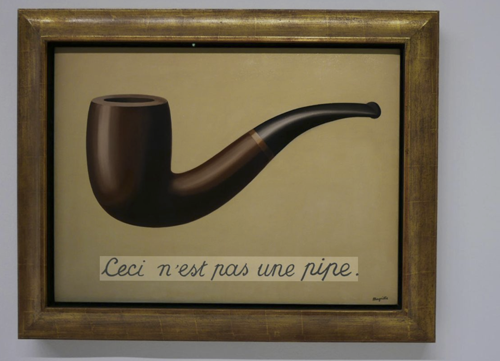
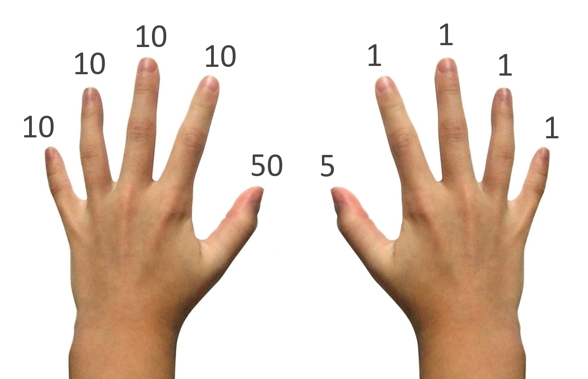
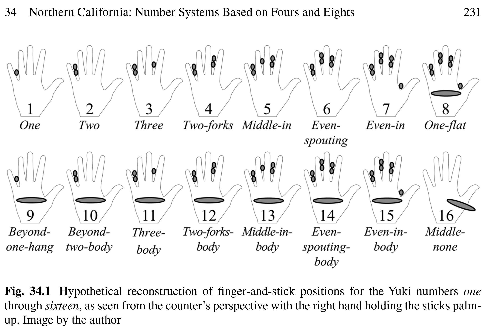
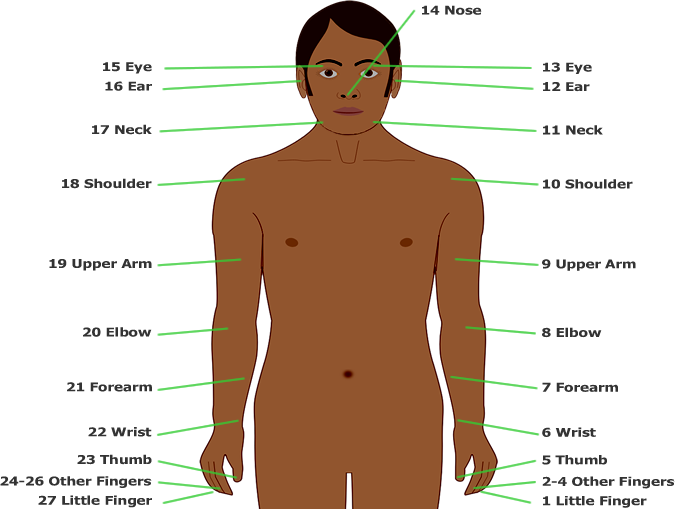
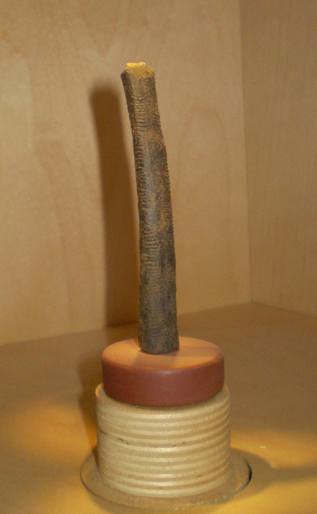
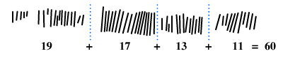
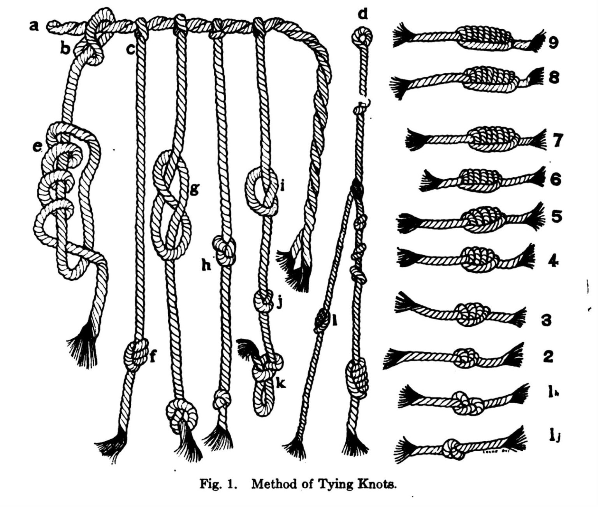

<!-- _class: lead -->
<!-- _paginate: false -->

# Símbolos como tecnología para computar
# ¿Cuál es el tema?
## Por qué contar no es lo mismo que numerar — y por qué importa

*CBIT010 · Introducción al Análisis de Datos y Programación*

---

<!-- _class: dark -->

# 🌳

## ¿Qué es esto?

---

# Esto no es un árbol

No pueden treparlo. No fotosintetiza. No alberga epífitas.

Es un patrón de píxeles — que es un patrón de valores RGB — que es un patrón de bytes — que es un patrón de voltajes en la pantalla.

Entre este símbolo y un *Nothofagus dombeyi* en la selva valdiviana hay **al menos cinco capas de abstracción**.

Solo que es relevante darnos cuenta es que *cada una de esas capas* es un **invento humano**.

> Tratemos de entender esas capas. Sobre todo por qué son relevantes y nos son funcionales.

---

<!-- _class: pregunta -->

# *"Ceci n'est pas une pipe."*

*René Magritte, La Trahison des Images, 1929*

<div class="img-placeholder">




</div>

*No es una pipa. Es una pintura de una pipa. No se puede fumar.*

---

# La distinción fundamental

El **símbolo** no es la **cosa**.

El mapa no es el territorio.
La palabra "fuego" no quema.
El número "3" no es una cantidad — es una marca en un pizarrón.

Aunque parece obvio, lo olvidamos constantemente.

> Y ese olvido esconde una de las ideas más poderosas de la historia humana: que **la elección del sistema de símbolos determina lo que se puede hacer con ellos**.

---

<!-- _class: invert -->

# De contar a numerar
## Una historia de la representación

---

# Nivel 0: El cuerpo

Antes de los símbolos, estaban **los dedos**.

El cuerpo es la primera herramienta de conteo — y la razón por la que usamos base 10.

Pero los Yuki de California contaban los **espacios entre dedos** → base 8.
Los Mayas contaban dedos de manos **y** pies → base 20.

<div class="img-placeholder">

<!-- ! -->
 

<!-- 📎 IMAGEN: Manos mostrando conteo con dedos, o diagrama comparativo de bases corporales
Buscar: "finger counting systems different cultures" -->
</div>

> La base no es una propiedad de los números. Es un accidente del cuerpo.

---

# Nivel 1: La marca — Contar cosas

La forma más antigua de representación: **una marca por cada cosa**.

||||  ||||  ||||  ||||  ||||  ||||  → 24

- Muescas en un hueso (hueso de Ishango, ~20.000 a.C.)
- Piedras en un montón (*calculus* = piedritas en latín → cálculo)
- Nudos en una cuerda

<div class="img-placeholder">

 
<!-- 📎 IMAGEN: Hueso de Ishango (muescas paleolíticas)
Fuente: Royal Belgian Institute of Natural Sciences / Wikimedia Commons -->
</div>

**Ventaja:** cualquiera lo entiende. No se necesita convención.
**Problema:** escala fatal. ¿Cómo representar 10.000? ¿Cómo multiplicar?

---

# Nivel 2: La agrupación — Signos que "pesan" más

Invento clave: algunos símbolos **valen más que otros**.

**Números romanos:**

| Símbolo | I | V | X | L | C | D | M |
|---|---|---|---|---|---|---|---|
| **Valor** | 1 | 5 | 10 | 50 | 100 | 500 | 1000 |

XLVII = 40 + 5 + 1 + 1 = **47**

Mejor que marcas: "mil" se escribe con una sola letra (M), no con mil marcas.

**Pero...**

---

<!-- _class: pregunta -->

# Intenten multiplicar XLVII × XIV

*En serio. Con lápiz y papel. Usando solo símbolos romanos.*

*(...se puede hacer, pero es una tortura.)*

---

# El problema de Roma

Los números romanos son **aditivos**: cada símbolo tiene un valor fijo, y se suman (o restan).

Eso los hace legibles → buenos para **etiquetar** (relojes, papas, Super Bowls).

Pero terribles para **computar**. No hay un algoritmo simple para multiplicar.

> **La notación determina qué operaciones son posibles.** Un sistema de escritura numérica no es solo una forma de anotar — es una **tecnología de pensamiento**.

---

<!-- _class: invert -->

# La revolución silenciosa
## El sistema posicional

---

# Nivel 3: La posición importa

**La idea:** el mismo símbolo significa cosas diferentes **según dónde está**.

`234`:
- El `2` vale **200** (2 × 10²)
- El `3` vale **30** (3 × 10¹)
- El `4` vale **4** (4 × 10⁰)

Tres símbolos. Tres posiciones. El valor depende del lugar.

> Inventado probablemente en la India, ~siglo V. Transmitido por los árabes a Europa entre los siglos X y XIII. Tardó **800 años** en reemplazar los números romanos.

---

# El invento más aterrador: el cero

Para que el sistema posicional funcione, necesitamos un símbolo para **la nada**.

Sin cero, no se distingue entre:
- `34` (treinta y cuatro)
- `304` (trescientos cuatro)
- `340` (trescientos cuarenta)

El cero es un **marcador de posición vacía**: dice "aquí no hay nada, pero el lugar importa."

<div class="img-placeholder">
📎 IMAGEN: Inscripción de Gwalior (India, siglo IX) — primer uso documentado del cero como dígito
Buscar: "Gwalior zero inscription" o "earliest zero India"
</div>

> La idea de que **la ausencia puede tener un nombre** fue filosóficamente radical. Algunas culturas la resistieron durante siglos.

---

# ¿Por qué funciona tan bien?

Porque el sistema posicional **codifica el algoritmo dentro de la notación**.

Sumen 347 + 286:

```
  347
+ 286
-----
  633
```

El procedimiento es mecánico: sumar columna por columna, acarrear si pasa de 9. No necesitan *pensar* — solo seguir la regla.

> Los números romanos no tienen esta propiedad. No existe un procedimiento columnar para CCCXLVII + CCLXXXVI.

**El sistema posicional es la primera tecnología computacional de la humanidad.** Precedió al computador electrónico por 1.500 años — pero la lógica es la misma.

---

# El quipu: posición sin escritura

Los Incas codificaban información en **cuerdas con nudos**.

- La **posición** del nudo en la cuerda indica la potencia (unidades, decenas, centenas)
- El **tipo** de nudo indica el dígito (1–9)
- El **color** de la cuerda indica la categoría (tributo, censo, cosecha)

Un sistema **posicional, base 10**, sin papel ni tinta.

<div class="img-placeholder">

 
<!-- 📎 IMAGEN: Quipu inca (fotografía de museo o diagrama explicativo)
Buscar: "quipu inca museo" o "quipu counting system diagram"
Fuente sugerida: Museo Larco (Lima), Smithsonian, o Wikimedia Commons -->
</div>

> Los sistemas de representación no son un invento europeo ni moderno. Toda cultura que necesitó gestionar complejidad inventó alguna forma de codificación simbólica.

---

# Los Mayas: el cero independiente

Los Mayas desarrollaron **independientemente** un sistema posicional en base 20, con un símbolo para el cero (un glifo de concha).

- Punto = 1
- Barra = 5
- Concha = 0

Podían representar números enormes (fechas calendáricas de millones de días) con combinaciones simples.

<div class="img-placeholder">
📎 IMAGEN: Numerales mayas (puntos, barras, concha de cero)
Buscar: "maya numerals system" o "sistema numeral maya"
</div>

> Dos civilizaciones sin contacto, la misma solución. La notación posicional no es arbitraria — es **convergente**: la encuentran las culturas que la necesitan.

---

<!-- _class: invert -->

# Símbolos, bases y poder expresivo
## ¿Cuánto se puede decir con cuánto?

---

# La pregunta central

Si tengo **b** símbolos distintos y puedo escribir secuencias de **n** posiciones...

**¿Cuántas cosas diferentes puedo representar?**

---

# La respuesta: b elevado a n

Con **b** símbolos y **n** posiciones:

## Combinaciones posibles = bⁿ

Esto es el corazón de todo sistema de representación.

---

# Ejemplo: un candado

Un candado de combinación con **4 ruedas** y **10 dígitos** por rueda (0–9):

Combinaciones = 10⁴ = **10.000**

¿Y si cada rueda tuviera solo 2 opciones (0 y 1)?

Combinaciones = 2⁴ = **16**

¿Y si tuviera 16 opciones por rueda (0–F)?

Combinaciones = 16⁴ = **65.536**

> **Más símbolos × más posiciones = capacidad expresiva explosiva.**

---

# Comparemos sistemas numéricos

¿Cuántos valores distintos puedo representar con **8 posiciones**?

| Sistema | Base (b) | Posiciones (n) | Valores = bⁿ |
|---|---|---|---|
| Binario | 2 | 8 | 2⁸ = **256** |
| Octal | 8 | 8 | 8⁸ = **16.777.216** |
| Decimal | 10 | 8 | 10⁸ = **100.000.000** |
| Hexadecimal | 16 | 8 | 16⁸ = **4.294.967.296** |

Con solo **8 posiciones**, la diferencia entre 256 y 4 mil millones está en el número de símbolos disponibles.

---

# Pero hay un costo oculto

Más símbolos por posición → cada símbolo es **más difícil de distinguir**.

| Base | Símbolos necesarios | Facilidad de implementación |
|---|---|---|
| 2 (binario) | 0, 1 | Trivial: voltaje alto / bajo |
| 10 (decimal) | 0–9 | Necesito distinguir 10 niveles de voltaje |
| 16 (hex) | 0–F | 16 niveles — frágil ante el ruido |
| 256 | 0–255 | 256 niveles — prácticamente imposible con voltaje |

> **El binario es la base óptima para máquinas** porque minimiza el error. Dos estados son lo más fácil de distinguir en presencia de ruido.

---

# La analogía ecológica

Piensen en un código de colores para marcar aves en campo.

| Código | Colores | Anillos por pata | Individuos distinguibles |
|---|---|---|---|
| Sencillo | 2 (blanco, negro) | 4 | 2⁴ = 16 |
| Medio | 5 colores | 4 | 5⁴ = 625 |
| Completo | 10 colores | 4 | 10⁴ = 10.000 |

**Pero** a 50 metros, ¿pueden distinguir 10 colores en un anillo de 3mm?

Probablemente no. En la práctica, se usan ~5 colores y más anillos.

> El mismo compromiso que en computación: **más símbolos = más capacidad, pero más difícil de leer sin error.**

---

<!-- _class: invert -->

# El poder del sistema posicional
## Lo que la posición regala

---

# Lo que gana el sistema posicional

**1. Finitud de símbolos.** Con solo 10 dígitos (o 2, o 16) represento *cualquier* cantidad. No necesito inventar nuevos símbolos para números grandes.

**2. Algoritmos universales.** Las reglas de sumar, restar, multiplicar, dividir funcionan igual para cualquier número, sin importar su magnitud. El procedimiento es **mecánico** — no requiere ingenio caso por caso.

**3. Escalabilidad.** Para representar un número 10 veces más grande, necesito solo **una posición más**. El crecimiento es logarítmico: el "costo" de representar un número es proporcional a su número de dígitos, no a su valor.

> Con 10 dígitos decimales represento hasta 9.999.999.999 (diez mil millones). Con 10 marcas de conteo represento... 10.

---

# Escalabilidad: la magia del logaritmo

| Cantidad | Marcas de conteo | Dígitos decimales | Bits (binario) |
|---|---|---|---|
| 7 | ꖼꖼꖼꖼꖼꖼꖼ | 1 | 3 |
| 100 | (100 marcas) | 3 | 7 |
| 10.000 | (10.000 marcas) | 5 | 14 |
| 1.000.000 | (imposible) | 7 | 20 |
| Átomos en el universo (~10⁸⁰) | (absurdo) | 81 | ~266 |

> Con **266 bits** puedo enumerar cada átomo del universo observable. Eso es el poder del sistema posicional: crecimiento **logarítmico** del costo de representación.

---

# La representación define el pensamiento

El historiador de las matemáticas Georges Ifrah escribió:

> *"La invención del cero y del sistema posicional es quizás el mayor logro intelectual del género humano."*

No es exageración. Sin esta tecnología simbólica:

- No hay álgebra
- No hay cálculo
- No hay ciencia cuantitativa
- No hay computadores

**El sistema posicional hizo posible pensar en grande** — y pensar mecánicamente. Los computadores son la consecuencia última de una idea que nació hace 1.500 años.

---

<!-- _class: invert -->

# De los números a todo lo demás
## El salto a la codificación universal

---

# El paso conceptual más importante

Si un sistema posicional puede representar **cualquier cantidad** con un conjunto finito de símbolos...

¿Puede representar **cualquier cosa**?

**Sí** — si acordamos una tabla de correspondencias.

| Código | Significado acordado |
|---|---|
| 65 | La letra "A" |
| 66 | La letra "B" |
| (255, 0, 0) | El color rojo |
| 440 Hz | La nota La |

> El acuerdo es **arbitrario pero necesario**. Sin convención, los números no significan nada más que cantidades. Con convención, significan *todo*.

---

# La cadena de abstracción

```
Mundo real          →  Convención   →  Número    →  Binario       →  Voltajes
─────────────────────────────────────────────────────────────────────────────
Un Nothofagus       →  "N" = 78    →  78        →  01001110      →  ⊥⊤⊥⊥⊤⊤⊤⊥
El color verde      →  RGB(0,128,0)→  0,128,0   →  tres bytes    →  voltajes
Un canto de chucao  →  muestreo    →  44100/seg →  secuencia     →  voltajes
```

En cada paso: algo concreto se convierte en algo abstracto. Y en cada paso, **se pierde algo** (el olor del bosque, la textura de la corteza) pero **se gana algo** (la capacidad de almacenar, transmitir, copiar, procesar).

> **Toda digitalización es una negociación entre fidelidad y manipulabilidad.**

---

# ¿Cuántos bits para cuánta realidad?

| Cosa | Bits necesarios | Convención |
|---|---|---|
| Un sí o un no | 1 | — |
| Una letra | 8 | ASCII |
| Un píxel | 24 | RGB |
| Un segundo de sonido CD | 1.411.200 | PCM 44.1kHz / 16bit / estéreo |
| Una foto (12 MP) | ~290.000.000 | RAW sin comprimir |
| El genoma humano | ~6.400.000.000 | 2 bits por par de bases |

> Cada fila de esta tabla es un **acuerdo** sobre cuántos bits dedicar a representar una porción de la realidad. Más bits = más fidelidad, pero más costo.

---

<!-- _class: pregunta -->

# La gran pregunta

# Si todo se puede reducir a secuencias de 0 y 1...

# ¿qué distingue a una foto de una sinfonía de un genoma de una instrucción de programa?

---

# Solo la convención

La secuencia `01001110` puede ser:

- La letra **"N"** (si la interpreto como ASCII)
- El número **78** (si la interpreto como entero)
- Un tono de **gris claro** (si la interpreto como valor de píxel)
- La instrucción **"mueve el dato"** (si la interpreto como código máquina)

**La misma secuencia de bits. Cuatro significados completamente diferentes.**

> El hardware solo ve voltajes. **El significado lo ponemos nosotros.** El estándar (ASCII, RGB, x86) es el contrato social que hace posible la comunicación entre humanos y máquinas.

---

<!-- _class: invert -->

# ¿Y entonces?
## Lo que esto cambia

---

# Tres ideas para llevarse

**1. Un sistema numérico es una tecnología, no un descubrimiento.**
Fue inventado, y su diseño determina qué se puede computar con facilidad. Los computadores no "eligieron" el binario — les fue impuesto por la física de los transistores.

**2. El poder expresivo crece exponencialmente con las posiciones.**
Con bⁿ combinaciones, unos pocos bits representan universos enteros. 8 bits = 256 valores. 32 bits = 4 mil millones. 64 bits = más valores que estrellas en la galaxia.

**3. Todo dato digital es una convención sobre cómo interpretar bits.**
Sin el acuerdo, los bits no significan nada. El acuerdo (ASCII, RGB, UTF-8) es tan importante como los bits mismos.

---

# La conexión con lo que viene

| Esta clase                    | Lo que viene                                                                              |
| ----------------------------- | ----------------------------------------------------------------------------------------- |
| El símbolo no es la cosa      | **Sem. 6:** ¿Los LLMs "entienden" o solo manipulan símbolos?                              |
| Sistemas posicionales         | **Sem. 2:** Binario, hexadecimal, conversiones                                            |
| bⁿ combinaciones              | **Sem. 2:** ¿Cuántos colores tiene RGB? 256³ = 16 millones                                |
| La convención es arbitraria   | **Sem. 2:** ASCII, UTF-8, y el problema de la ñ                                           |
| Costo de representación       | **Sem. 3:** Entropía — ¿cuántos bits *realmente* necesita un mensaje?                     |
| Fidelidad vs. manipulabilidad | **Sem. 7:** IA en conservación — qué se gana y qué se pierde al digitalizar un ecosistema |

---

# Para pensar fuera de la sala

*"La civilización avanza extendiendo el número de operaciones importantes que podemos hacer sin pensar en ellas."*
— Alfred North Whitehead

Los sistemas posicionales fueron la primera vez que la humanidad delegó cálculos a un **procedimiento mecánico** en vez de al ingenio individual.

Los computadores son la extensión natural de esa idea.

Y los LLMs son el paso más reciente: delegar no solo el cálculo, sino la **manipulación del lenguaje** a un procedimiento mecánico.

> ¿Qué se gana? ¿Qué se pierde? Esa pregunta nos acompañará todo el semestre.

---

<!-- _class: lead -->
<!-- _paginate: false -->

# El símbolo no es la tema.
# Pero un buen sistema de símbolos
# cambia lo que podemos pensar.
