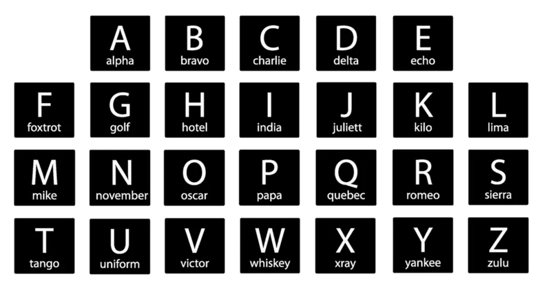
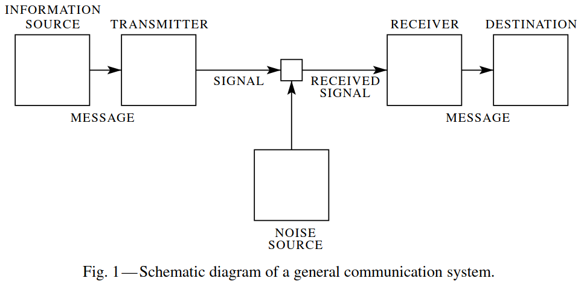
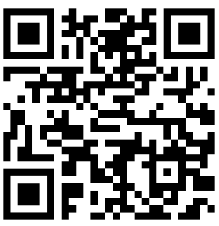

<!-- _class: lead -->
<!-- _paginate: false -->

# Redundancia, canales y ruido
## Cómo la información sobrevive a un mundo imperfecto

*Complemento Semana 3 · Teoría de la Información*
*Facultad de Ciencias Forestales y Recursos Naturales · UACh*

---

<!-- _class: pregunta -->

# 🗣️ : Un experimento 

# Le gritan a un compañero al otro lado de una cancha:

# *"¡LA MESTRA SE ENC_ENTRA EN L_ SAL_ 20_!"*

# ¿Entienden el mensaje?

---

# Sí, lo entienden !

Aunque faltan letras, reconstruyen:

*"¡La **muestra** se **encuentra** en la **sala** **205**!"*

¿Cómo? Porque el español es **redundante**: tiene más estructura de la estrictamente necesaria. El contexto, la gramática y la frecuencia de las letras permiten **rellenar los huecos**.

> **Redundancia** = la parte del mensaje que se puede reconstruir a partir del resto. Es lo "predecible" del mensaje.

Y esa redundancia, lejos de ser un defecto, es lo que hace posible la comunicación en un mundo ruidoso.

---

<!-- _class: invert -->

# Parte 1
## ¿Qué es la redundancia?

---

# Redundancia: lo predecible del mensaje

En español, si ven la letra **Q**, ¿qué letra viene después?

Casi siempre: **U**. La U después de Q no sorprende $\rightarrow$ aporta **poca información**.

Si elimináramos la U en "que", "quiero", "quizás"... ¿se perdería el significado?
> "Q T PA!?"

No. Podrían reconstruirlo por contexto. La U es **redundante**.

> **Redundancia = 1 − (entropía real / entropía máxima)**

---

# Cuantificando la redundancia del español

Si las 27 letras + espacio fueran equiprobables:

**H máxima** = log₂(28) ≈ **4.81 bits** por carácter

Pero no lo son. La E aparece ~13%, la W ~0.01%. Considerando frecuencias:

**H real** ≈ **4.0 bits** por carácter

Y si consideramos pares de letras, tripletes, palabras:

**H real (con contexto)** ≈ **1.5–2.0 bits** por carácter

> El español tiene una **redundancia de ~60–70%**. Más de la mitad de lo que escribimos es "predecible".

---

# ¿Es mala la redundancia?

**Para compresión:** sí, es desperdicio. ZIP, JPEG, MP3 funcionan *eliminando* redundancia.

**Para comunicación en ambientes ruidosos:** no, es una **protección**. La redundancia permite reconstruir el mensaje cuando hay errores.

<!--
<div class="img-placeholder">
📎 FIGURA: Diagrama de balanza — un lado dice "Eficiencia" (compresión, menos bits) y el otro "Robustez" (redundancia, resistencia al error). El punto de equilibrio es el diseño del código.
Buscar: "compression vs redundancy tradeoff diagram" o dibujar uno propio.
</div>
-->

> La naturaleza resolvió esto hace millones de años: el código genético tiene **redundancia incorporada** (varios codones codifican el mismo aminoácido).

---

<!-- _class: ejemplo -->

# Ejemplo: redundancia en el código genético

| Aminoácido | Codones que lo codifican |
|---|---|
| Leucina | UUA, UUG, CUU, CUC, CUA, CUG (**6 codones**) |
| Metionina | AUG (**1 solo codón**) |
| Serina | UCU, UCC, UCA, UCG, AGU, AGC (**6 codones**) |

Una mutación puntual en el tercer nucleótido de un codón de Leucina **muchas veces no cambia la proteína** → la redundancia protege contra errores de copia.

> El ADN es un sistema de codificación con redundancia incorporada. La evolución "descubrió" los códigos correctores de errores miles de millones de años antes que Shannon.

---

<!-- _class: ejemplo -->
<!-- _footer: "" -->
# Ejemplo: redundancia en la comunicación oral

¿Por qué decimos **"sí"** y no solo **"s"**?

¿Por qué el alfabeto fonético de aviación dice **"Alpha, Bravo, Charlie"** en vez de **"A, B, C"**?

<div class="img-placeholder">



</div>

Porque en un canal ruidoso (radio, viento, motor), las letras individuales son fáciles de confundir. Palabras largas y sonoras son **más redundantes** → más resistentes al ruido.

> Más redundancia = menos eficiencia, **pero más confiabilidad**.

---

<!-- _class: invert -->

# Parte 2
## El modelo del canal de comunicación

---

# El esquema de Shannon (1948)

Todo sistema de comunicación tiene la misma estructura:

```
┌──────────┐    ┌───────────┐    ┌─────────┐    ┌──────────────┐    ┌──────────┐
│  Fuente  │ →  │Transmisor │ →  │  Canal  │ →  │  Receptor    │ →  │ Destino  │
│  (mensaje)│   │(codifica)  │   │ + RUIDO │   │(decodifica)   │   │(interpreta)│
└──────────┘    └───────────┘    └─────────┘    └──────────────┘    └──────────┘
                                      ↑
                                   RUIDO
                              (interferencia)
```

<div class="img-placeholder">



</div>

---

# ¿Qué es cada parte?

| Componente | En telecomunicaciones | En ecología (monitoreo) | En la sala de clases |
|---|---|---|---|
| **Fuente** | Persona que habla | Canto de un ave | El docente |
| **Transmisor** | Micrófono → señal eléctrica | AudioMoth → archivo WAV | Voz → ondas de sonido |
| **Canal** | Cable telefónico | Aire entre el ave y el micrófono | El aire del auditorio |
| **Ruido** | Interferencia eléctrica | Viento, lluvia, otras especies | Conversaciones, celulares |
| **Receptor** | Altavoz → sonido | Software de análisis | El oído del estudiante |
| **Destino** | Persona que escucha | Investigador que interpreta | El cerebro del estudiante |

> **Todo** sistema de comunicación cabe en este esquema. Desde un cable transatlántico hasta una conversación de pasillo.

---

<!-- _class: pregunta -->

# 🤔 ¿Pueden identificar fuente, transmisor, canal, ruido, receptor y destino...

# ...en una llamada por celular?
# ...en una foto satelital de un bosque?
# ...en la lectura de una muestra de ADN?

---

# La llamada por celular

| | |
|---|---|
| **Fuente** | Tu voz |
| **Transmisor** | Micrófono del celular → codificación digital → antena |
| **Canal** | Ondas de radio entre tu celular y la torre |
| **Ruido** | Otros celulares, microondas, paredes, distancia |
| **Receptor** | Antena del otro celular → decodificación → parlante |
| **Destino** | El oído de tu interlocutor |

¿Por qué a veces se "corta"? El ruido supera la capacidad del canal → los bits llegan con errores que no se pueden corregir.

---

# La foto satelital

| | |
|---|---|
| **Fuente** | La superficie terrestre (reflectancia del bosque) |
| **Transmisor** | El sensor del satélite (captura fotones → convierte a señal) |
| **Canal** | La atmósfera (entre la superficie y el sensor) |
| **Ruido** | Nubes, aerosoles, sombras, ángulo solar |
| **Receptor** | Estación receptora en tierra → imagen digital |
| **Destino** | El ecólogo que clasifica uso de suelo |

---
# La foto satelital


<div class="img-placeholder">

 --  


> Las nubes son **ruido** en el canal atmosférico. Por eso se usan composiciones multitemporales: la redundancia temporal (muchas imágenes de la misma zona) permite "eliminar" las nubes.


---
<!-- _class: invert -->

# Parte 3
## ¿Qué es el ruido?

---

# Ruido: todo lo que corrompe el mensaje

El ruido no es necesariamente "sonido". Es cualquier proceso que **altera la señal** entre el transmisor y el receptor.

| Tipo de canal | Ejemplo de ruido |
|---|---|
| Cable eléctrico | Interferencia electromagnética |
| Aire (sonido) | Viento, otras voces, eco |
| Aire (radio) | Otros transmisores, paredes |
| Atmósfera (satélite) | Nubes, aerosoles, vapor de agua |
| Disco duro | Degradación magnética, bits que se "voltean" |
| ADN | Radiación UV, errores de polimerasa |
| Muestreo ecológico | Detección imperfecta, error de identificación |

> En cada caso: la información **original** entra al canal, y algo **diferente** sale del otro lado.

---

# Visualizando el ruido

Imaginen que envío la letra **A** (01000001) por un canal ruidoso.

**Sin ruido:**
Envío: `01000001` → Recibo: `01000001` → ✅ "A"

**Con ruido (1 bit alterado):**
Envío: `01000001` → Recibo: `01000**1**01` → ❌ "E" (69)

**Con ruido (2 bits alterados):**
Envío: `01000001` → Recibo: `01**1**00**1**01` → ❌ "e" (101)

> **Un solo bit de error cambia completamente el significado.** El receptor no tiene forma de saber que hubo un error — a menos que el código tenga protección.

---

<!-- _class: ejemplo -->

# Demostración en vivo: el teléfono descompuesto

*Jugar una ronda rápida de "teléfono descompuesto" con el curso.*

El docente susurra una frase al primer estudiante de una fila. Cada estudiante la pasa al siguiente susurrando.

**Frase sugerida:** *"El chungungo come erizos en la costa de Valdivia"*

Comparar la frase original con la que llega al final.

**Preguntas para la discusión:**
- ¿Dónde se introdujo el error? → En **cada transmisión** (cada oído es un canal ruidoso)
- ¿Se acumularon los errores? → Sí, **el ruido se acumula** en cada eslabón
- ¿Cómo se podría evitar? → Repetición, deletreo, escritura → **redundancia**

---

<!-- _class: invert -->

# Parte 4
## ¿Cómo sobrevive la información al ruido?

---

# Estrategia 1: Repetición (fuerza bruta)

La idea más simple: **enviar cada bit varias veces**.

Quiero enviar `1 0 1`:

| Sin protección | Con repetición ×3 |
|---|---|
| `1 0 1` | `111  000  111` |

Si el canal corrompe un bit:

Recibo: `111  0**1**0  111`

Decodifico por **mayoría**: 1, 0, 1 ✅ — el error se corrigió.

**Costo:** la tasa de transmisión se reduce a **1/3**. Envío 3 veces más datos para transmitir lo mismo.

> Simple pero caro. ¿Se puede hacer mejor?

---

# Estrategia 2: Bit de paridad (detección, no corrección)

Agregar **un bit extra** que indica si la cantidad de 1s es par o impar.

Dato: `1010010` → tiene 3 unos (impar) → agrego un `1` → `1010010**1**`

Si llega `10**0**00101`, cuento los 1s: 3 (impar) → pero el bit de paridad dice "par" → **sé que hay un error**, aunque no sé cuál bit falló.

<div class="img-placeholder">
📎 FIGURA: Diagrama mostrando un byte con bit de paridad. Resaltar cómo se detecta el error cuando la paridad no cuadra.
Buscar: "parity bit diagram" o "parity check explanation visual"
</div>

> Un solo bit extra me permite **detectar** errores de 1 bit. Pero no corregirlos — necesito pedir retransmisión.

---

# Estrategia 3: Códigos correctores de errores

**Idea clave:** agregar bits extra **estratégicamente** para que el receptor pueda no solo detectar sino **localizar y corregir** el error.

**Código de Hamming (1950):** con solo 3 bits extra, protege un bloque de 4 bits de datos.

| Datos | Bits de Hamming | Transmitido |
|---|---|---|
| `1011` | se calculan como `010` | `1011010` |

Si un bit se corrompe → las verificaciones de paridad cruzada señalan **exactamente cuál bit falló** → se corrige automáticamente.

<div class="img-placeholder">
📎 FIGURA: Diagrama de Venn del código de Hamming (3 círculos superpuestos, bits de datos en las intersecciones, bits de paridad en las regiones exclusivas). Este diagrama es muy intuitivo.
Buscar: "Hamming code Venn diagram" — es una imagen clásica de libros de texto.
</div>

> La magia: **corregir sin retransmitir.** Esto es lo que usa la RAM de un servidor, un CD de audio, y la transmisión de datos desde Voyager 1.

---

# ¿Dónde vemos esto en la vida real?

| Tecnología | Mecanismo de protección | Tipo |
|---|---|---|
| **Código QR** | Hasta 30% del código puede estar dañado y sigue legible | Corrección (Reed-Solomon) |
| **CD/DVD** | Rayaduras no afectan la reproducción (hasta cierto punto) | Corrección (Reed-Solomon) |
| **Internet (TCP)** | Si un paquete llega corrupto, se pide retransmisión | Detección + retransmisión |
| **RAM ECC** (servidores) | Corrige errores de 1 bit en memoria | Corrección (Hamming) |
| **Código genético** | Codones redundantes, mecanismos de reparación del ADN | Redundancia + reparación |

---
<style scoped>  {font-size: 18px;} </style>
<!-- _class: ejemplo -->

# Ejemplo visual: el código QR

<div class="img-placeholder">

 -^^--^escanea me^--^^ 

<!--
📎 FIGURA: Dos códigos QR idénticos en contenido. El primero limpio, el segundo parcialmente cubierto con manchas o un logo encima — ambos escaneables.
Buscar: "QR code error correction example" o generar uno en qr-code-generator.com y taparlo parcialmente.
Mejor aún: generar un QR en clase con un mensaje ecológico y pedir a los estudiantes que lo escaneen después de taparlo parcialmente con cinta adhesiva.
-->
</div>

Los códigos QR tienen **4 niveles** de corrección de errores:

| Nivel | Datos recuperables si se dañan |
|---|---|
| L (bajo) | 7% |
| M (medio) | 15% |
| Q (alto) | 25% |
| H (máximo) | **30%** |

Nivel H: casi un tercio del código puede estar destruido y sigue funcionando.

> El costo: a mayor protección, el QR necesita ser **más grande** (más módulos). Misma lógica: redundancia = protección, pero cuesta espacio.

---

<!-- _class: invert -->

# Parte 5
## El teorema de Shannon: el límite fundamental

---

# La pregunta de Shannon

*"¿Se puede transmitir información sin errores por un canal con ruido?"*

La respuesta intuitiva: no, siempre habrá errores.

**La respuesta de Shannon (1948): sí se puede** — si transmites más lento que la capacidad del canal.

---

# Capacidad del canal

Todo canal tiene una **capacidad C** (en bits por segundo) que depende de:

- El **ancho de banda** (cuántas "frecuencias" caben)
- La **relación señal/ruido** (cuánto más fuerte es la señal que el ruido)

> **Si la tasa de transmisión < C:** existen códigos que permiten comunicación **sin errores**.
> **Si la tasa > C:** los errores son **inevitables**, no importa qué código uses.

Shannon **demostró que el límite existe**, pero no dijo cómo construir los códigos óptimos. Eso tomó 50 años más de investigación.

---

# Analogía: el sendero en el bosque

Imaginen que deben transmitir un mensaje caminando por un sendero en el bosque valdiviano durante una tormenta.
<!--
<div class="img-placeholder">
📎 FIGURA: Foto de un sendero en el bosque valdiviano bajo lluvia o niebla. El sendero es el "canal", la lluvia y niebla son el "ruido".
Buscar: "sendero bosque valdiviano lluvia" o "alerce trail fog Valdivia"
</div>
-->

- **Canal:** el sendero
- **Ruido:** lluvia, viento, barro, visibilidad reducida
- **Capacidad:** cuántos mensajes por hora pueden pasar sin que se pierdan

Si intentan enviar mensajes **muy rápido** (correr bajo la lluvia), se caen, se pierden, los mensajes llegan ilegibles.

Si van **más lento** y repiten las partes importantes, los mensajes llegan bien.

> Shannon dice: hay una velocidad máxima a la que puedes caminar sin perder mensajes. Ir más lento: perfecto. Ir más rápido: imposible sin errores.

---

<!-- _class: invert -->

# Parte 6
## La conexión ecológica

---

# El muestreo ecológico como canal de comunicación

| Shannon | Ecología |
|---|---|
| **Fuente** | La biodiversidad real del sitio |
| **Transmisor** | El protocolo de muestreo |
| **Canal** | El proceso de observación |
| **Ruido** | Detección imperfecta, error de identificación, condiciones climáticas |
| **Receptor** | La planilla de datos |
| **Destino** | El ecólogo que analiza |

> Cuando hacen un censo de aves, la **comunidad real** es la fuente. Lo que llega a su planilla es la señal **después del ruido**. La pregunta es: ¿cuánto del mensaje original sobrevivió?

---

# Tipos de "ruido" en muestreo ecológico

| Tipo de error | Análogo en telecomunicaciones | Efecto |
|---|---|---|
| **Falso negativo** (especie presente pero no detectada) | Bit perdido | Subestimación de diversidad |
| **Falso positivo** (especie registrada pero no estaba) | Bit insertado | Sobreestimación |
| **Identificación errónea** (confundir especie A con B) | Bit invertido | Sesgo en composición |
| **Doble conteo** (contar el mismo individuo dos veces) | Eco/repetición | Sobreestimación de abundancia |

<!--
<div class="img-placeholder">
📎 FIGURA: Diagrama de una parcela de muestreo con íconos de aves. Algunas aves están "ocultas" (falsos negativos), una tiene un "?" (identificación dudosa), y una tiene una flecha circular (doble conteo).
Dibujar esquema simple o buscar: "imperfect detection ecology diagram"
</div>
-->
---

# La redundancia como solución ecológica

¿Cómo reducen el "ruido" en ecología? Con **redundancia**:

| Estrategia | Tipo de redundancia | Análogo técnico |
|---|---|---|
| **Repetir el muestreo** (múltiples visitas al mismo sitio) | Temporal | Retransmisión |
| **Múltiples observadores** (doble ciego) | Espacial/humana | Verificación cruzada |
| **Parcelas de control** | Comparativa | Checksum |
| **Modelos de ocupancia** (estiman p de detección) | Estadística | Código corrector de errores |
| **Grabación + revisión** (AudioMoth, cámaras trampa) | Registro permanente | Almacenamiento con respaldo |

> Cada estrategia **cuesta más** (tiempo, dinero, esfuerzo) pero **reduce el error**. Es exactamente el mismo compromiso que en telecomunicaciones: redundancia = protección, pero no es gratis.

---

# El paralelo profundo

Shannon demostró que hay un **límite teórico** a la tasa de comunicación sin errores (capacidad del canal).

En ecología, hay un **límite teórico** a la información que se puede extraer de un muestreo (dado el esfuerzo de muestreo y la probabilidad de detección).

- Si el esfuerzo de muestreo es **suficiente** → se puede estimar la diversidad real sin sesgo.
- Si el esfuerzo es **insuficiente** → el error es inevitable, no importa cuán sofisticado sea el análisis estadístico.

> **No se puede extraer información que el protocolo de muestreo no capturó.** Así como no se puede recibir bits que el canal no transmitió.

---

<!-- _class: ejemplo -->

# Ejemplo: la curva de acumulación de especies

<!--
<div class="img-placeholder">
📎 FIGURA: Curva de acumulación de especies (eje X = esfuerzo de muestreo, eje Y = número de especies detectadas). Mostrar cómo la curva se aplana — pero nunca llega al total real si la detección es imperfecta.
Buscar: "species accumulation curve" o "rarefaction curve ecology"
Ideal: una curva real de un estudio en bosque templado chileno.
</div>
-->

La curva se aplana cuando **la redundancia del muestreo** ya no aporta nuevas especies. Pero si la detección es imperfecta, la asíntota está **por debajo** de la riqueza real.

> La diferencia entre la asíntota observada y la riqueza real es el **ruido** que el protocolo no pudo eliminar. Los estimadores de riqueza (Chao1, Jackknife) son, en esencia, **códigos correctores de errores ecológicos**.

---

<!-- _class: invert -->

# Recapitulación

---

# Las tres ideas centrales

**1. Redundancia** es la parte predecible del mensaje.
Es "desperdicio" en eficiencia, pero **protección** en comunicación. La naturaleza la usa (código genético), la ingeniería la usa (QR, TCP, ECC), y la ecología la necesita (réplicas, múltiples visitas).

**2. Todo canal tiene ruido** — todo proceso de transmisión introduce errores.
El modelo de Shannon (fuente → transmisor → canal + ruido → receptor → destino) describe cualquier sistema de comunicación, desde un cable hasta un censo de aves.

**3. Existe un límite fundamental.**
Shannon demostró que la comunicación sin errores es posible si se respeta la capacidad del canal. En ecología: si el esfuerzo de muestreo es suficiente para la complejidad del sistema, se puede estimar bien. Si no, ningún análisis estadístico compensa.

---

# El mapa conceptual

```
INFORMACIÓN (Semana 3)
    │
    ├── Entropía H ──── mide la incertidumbre
    │                   (= diversidad en ecología)
    │
    ├── Redundancia ─── lo predecible del mensaje
    │       │           protege contra el ruido
    │       │           permite la compresión
    │       │
    │       └── Compresión ─── elimina redundancia (ZIP, JPEG)
    │           Protección ─── agrega redundancia (QR, Hamming, réplicas)
    │
    └── Canal + Ruido ── todo medio de transmisión corrompe
            │            la señal
            │
            └── Capacidad C ── límite de Shannon
                               no se puede superar
                               (= esfuerzo de muestreo suficiente)
```

---

<!-- _class: pregunta -->

# Para pensar

# Si su protocolo de muestreo es el "canal"...

# ¿Cuánta de la biodiversidad real llega a su planilla de datos?

# ¿Y qué pueden hacer para aumentar esa "capacidad"?

---

<!-- _class: lead -->
<!-- _paginate: false -->

# La información no viaja sola.
# Viaja por canales imperfectos.
# Y sobrevive gracias a la redundancia.

*Complemento Semana 3 · Redundancia, canales y ruido*
