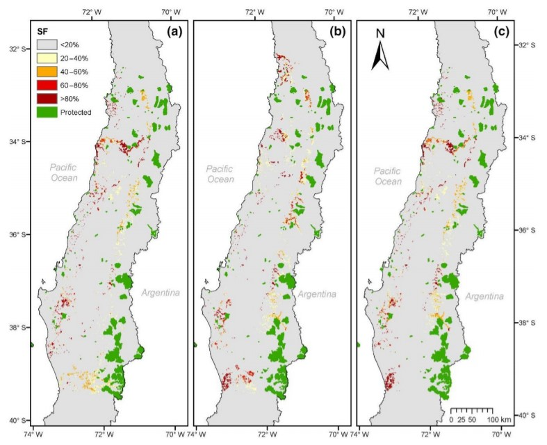
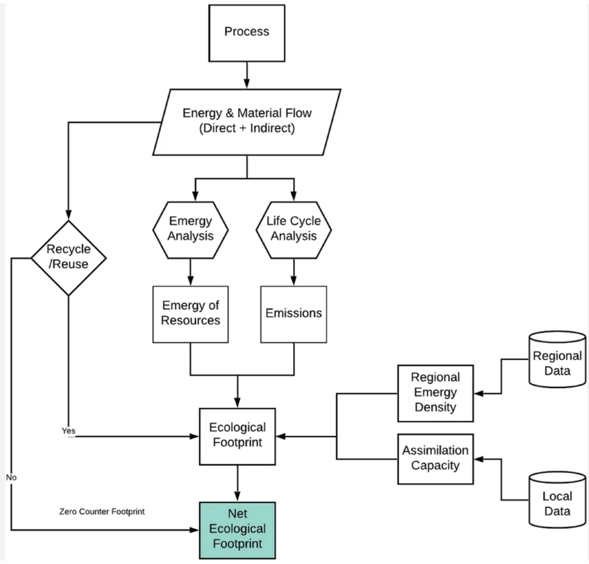
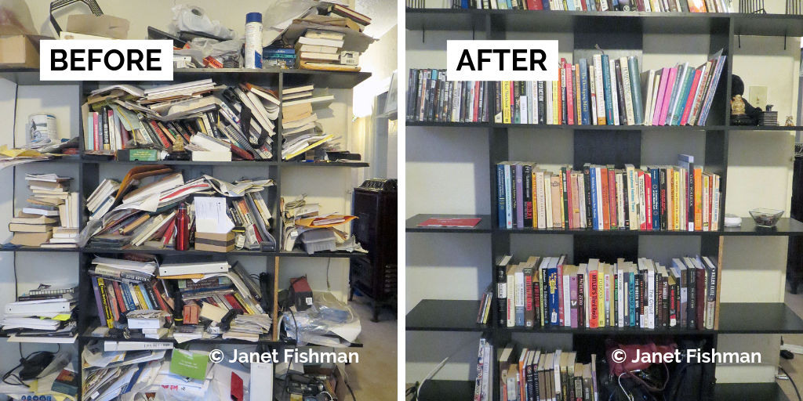
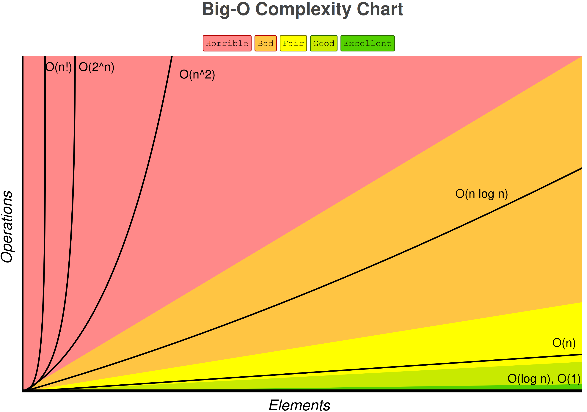

<!-- _class: lead -->
<!-- _paginate: false -->

# Pensamiento algorítmico
## Recetas para resolver problemas

*Semana 4 · Introducción al Análisis de Datos y Programación*
*Facultad de Ciencias Forestales y Recursos Naturales · UACh*

---

# Recuerdo de la Semana 3

- La **búsqueda binaria** en las 20 Preguntas: 4 preguntas para 16 animales
- Cada pregunta bien hecha descartaba **la mitad** de las opciones
- Hoy formalizamos eso: ¿qué hace que una estrategia sea un *algoritmo*?

---

# Hoja de ruta

1. 🥪 **La receta del sándwich** — por qué la precisión importa
2. 📋 **¿Qué es un algoritmo?** — cinco propiedades
3. 🔀 **Diagramas de flujo y pseudocódigo** — herramientas de expresión
4. 🔢 **Algoritmos de ordenamiento** — burbuja e inserción
5. 📈 **Complejidad** — ¿qué tan caro es resolver un problema?
6. 🧪 **Laboratorio** — Red de ordenamiento
7. 📝 **Control 2**

---

<!-- _class: pregunta -->

# 🥪 Actividad: explíquenme cómo hacer un sándwich

# Paso a paso. Voy a ejecutar sus instrucciones *literalmente*.

---
<!-- _footer: "" -->

# ¿Qué aprendimos del sándwich?

- "Pon el pan sobre la mesa" → ¿**Qué** pan? ¿**Cuál** mesa? ¿Con qué **lado** hacia arriba?

- "Ponle jamón" → ¿**Cuántas** láminas? ¿**Sobre** cuál cara?

- "Cierra el sándwich" → *Pone otro pan al lado* 🤷

> El lenguaje natural es **ambiguo**. Un computador ejecuta las instrucciones *al pie de la letra*.

 <div class="cols">

<div class="img-placeholder">


</div>

<div class="card">

¿Cómo se escribe una receta que no admita ambigüedad? **Eso es un algoritmo.**
</div>
</div>

---

<!-- _class: invert -->

# ¿Qué es un algoritmo?

---
<!-- _footer: "" -->


# Definición

Un **algoritmo** es un conjunto finito de instrucciones bien definidas que transforma una **entrada** en una **salida** deseada.

La palabra viene de **al-Juarismi** (Muhammad ibn Musa al-Khwarizmi, ~780–850), matemático persa (*i.e.* Iraní) que describió procedimientos paso a paso para resolver ecuaciones.

<div class="card">

 
</div>

> No es un invento moderno. Es una idea de más de mil años.

---
<style scoped>  {font-size: 32px;} </style>
# Las cinco propiedades

| | Propiedad | Significado | Contraejemplo |
|---|---|---|---|
|1.| **Finitud** | Termina en un número finito de pasos | "Repita hasta que sea perfecto" |
|2.| **Definición** | Cada paso es preciso, no ambiguo | "Agregue sal al gusto" |
|3.| **Entrada** | Recibe cero o más datos iniciales | — |
|4.| **Salida** | Produce al menos un resultado | Un proceso que nunca entrega nada |
|5.| **Efectividad** | Cada paso es realizable con los recursos disponibles | "Calcule todos los primos" (infinitos) |

---

<!-- _class: pregunta -->

# 🤔 *"Encontrar el mejor lugar para un área protegida"*

# ¿Es un algoritmo?

---
<!-- _footer: "" -->

#

# No — pero *puede* convertirse en uno

**"Mejor"** no está definido. ¿Mejor para qué especie? ¿Con qué presupuesto? ¿Minimizando qué función?

<div class="cols">
<div>
Si definimos:
*"Seleccionar el conjunto de parcelas que maximice el número de especies protegidas sin exceder un presupuesto de X millones"*

...entonces **sí** se puede construir un algoritmo (es un problema de optimización bien definido).
</div>
<div class="card">


</div>
</div
<!--
📎 IMAGEN: Un mapa de la red de áreas protegidas del sur de Chile (SNASPE), o una salida de Zonation/Marxan mostrando celdas priorizadas. El contraste entre "quiero proteger la naturaleza" (vago) y un mapa con celdas numeradas por prioridad (preciso) hace visible la diferencia entre deseo y algoritmo. Buscar: "SNASPE mapa Los Ríos" o "Zonation conservation prioritization Chile".
-->

> La diferencia entre un deseo vago y un algoritmo es la **precisión en la formulación**.

---

<!-- _class: invert -->

# Herramientas de expresión
## Diagramas de flujo y pseudocódigo

---
<!-- _footer: "" -->

# Diagrama de flujo: los símbolos

| Símbolo              | Forma           | Significado                  |
|----------------------|-----------------|------------------------------|
| **Inicio / Fin**     | Óvalo           | Marca comienzo o final       |
| **Proceso**          | Rectángulo      | Acción o cálculo             |
| **Decisión**         | Rombo           | Pregunta sí/no (bifurcación) |
| **Entrada / Salida** | Paralelogramo   | Lectura de datos o escritura |
| **Flecha**           | Línea con punta | Dirección del flujo          |

<div class="card">


</div>

---

# Ejemplo: ¿está amenazada esta especie?

<div class="img-placeholder">


<!--
📎 IMAGEN: Diagrama de flujo dibujado con las formas correctas (óvalo para inicio/fin, paralelogramos para E/S, rombos para decisiones, rectángulos para acciones) representando la clasificación UICN simplificada: INICIO → Leer(población, tendencia) → ¿Población < 1000? → Sí/No ramas → EN PELIGRO CRÍTICO / EN PELIGRO / VULNERABLE / PREOCUPACIÓN MENOR → FIN. Dibujar en draw.io, Excalidraw, o Mermaid y exportar como PNG. Colores sugeridos: rombos en amarillo, rectángulos de acción en verde, óvalos en gris.
-->

</div>

*Cada rombo = una decisión. Cada rectángulo = una acción. Las flechas = el flujo.*

---

# Pseudocódigo: el intermedio

No es un lenguaje de programación — es un **bosquejo** claro de la lógica.

**Convenciones que usaremos:**

```
LEER variable
ESCRIBIR variable
SI condición ENTONCES
    instrucciones
SINO
    instrucciones
FIN SI
PARA i DESDE a HASTA b HACER
    instrucciones
FIN PARA
MIENTRAS condición HACER
    instrucciones
FIN MIENTRAS
```

---

# El mismo ejemplo en pseudocódigo

```
LEER población, tendencia

SI población < 1000 ENTONCES
    SI tendencia = "decreciente" ENTONCES
        clasificación ← "En peligro crítico"
    SINO
        clasificación ← "En peligro"
    FIN SI
SINO SI población < 10000 ENTONCES
    clasificación ← "Vulnerable"
SINO
    clasificación ← "Preocupación menor"
FIN SI

ESCRIBIR clasificación
```

---

# ¿Cuál usar?

|                 | Diagrama de flujo                 | Pseudocódigo                    |
|-----------------|-----------------------------------|---------------------------------|
| **Formato**     | Visual                            | Textual                         |
| **Bueno para**  | Comunicar, vista panorámica       | Detallar, más cercano al código |
| **Malo para**   | Procedimientos largos (se enreda) | Personas no técnicas            |
| **Se parece a** | Un mapa                           | Una receta                      |

> En la Sección 2 del curso, el pseudocódigo se transformará en **Python** casi directamente.

---

<!-- _class: invert -->

# Algoritmos de ordenamiento
## Misma tarea, diferentes estrategias

---

# ¿Por qué ordenar?

- Ordenar especies por **abundancia** → identificar dominantes
- Ordenar parcelas por **riqueza** → priorizar las más diversas
- Ordenar datos por **fecha** → analizar tendencias

<div class="img-placeholder">



<!--
📎 IMAGEN: Foto de una estantería de biblioteca desordenada al lado de una ordenada. O una planilla de datos ecológicos desordenada vs. ordenada por abundancia. El contraste visual es inmediato: el orden permite encontrar cosas. Buscar: "messy vs organized bookshelf" o "unsorted vs sorted spreadsheet".
-->
</div>

> Ordenar es una de las operaciones más comunes en computación.

---

# Bubble Sort (Burbuja)

**Idea:** recorrer la lista comparando pares adyacentes. Si están desordenados, intercambiarlos. Repetir hasta que no haya más intercambios.

<div class="img-placeholder">
📎 IMAGEN: Animación o diagrama paso a paso de bubble sort con barras de colores (cada barra = un valor, la altura = su magnitud). Dos opciones: (1) GIF animado — buscar "bubble sort animation bars gif" en Wikipedia o VisuAlgo.net. (2) Imagen estática con las pasadas dibujadas como filas sucesivas, flechas indicando los intercambios. Fuente sugerida: Wikipedia "Bubble sort" tiene un GIF de dominio público excelente.
</div>

> Después de cada pasada, el número más grande queda en su lugar. Como una burbuja que sube.

---

# Bubble Sort: pseudocódigo

```
PARA i DESDE 1 HASTA n-1 HACER
    PARA j DESDE 1 HASTA n-i HACER
        SI lista[j] > lista[j+1] ENTONCES
            intercambiar(lista[j], lista[j+1])
        FIN SI
    FIN PARA
FIN PARA
```

Dos bucles anidados → cada elemento se compara con (casi) todos los demás.

---

# Insertion Sort (Inserción)

**Idea:** mantener una parte "ya ordenada" e ir insertando cada nuevo elemento en su posición correcta.

**Analogía:** así ordenamos las cartas en la mano — tomamos una del mazo y la deslizamos al lugar correcto.

<div class="img-placeholder">
📎 IMAGEN: Foto de manos sosteniendo cartas de póker/naipe, en el acto de insertar una carta en su posición correcta entre las ya ordenadas. Cualquier estudiante ha hecho esto. Buscar: "sorting playing cards hand insertion" o "ordering cards in hand". Alternativa: diagrama de Wikipedia "Insertion sort" — tiene un buen GIF con barras de colores.
</div>

```
[5, | 2, 8, 1]  → insertar 2 → [2, 5, | 8, 1]
[2, 5, | 8, 1]  → insertar 8 → [2, 5, 8, | 1]
[2, 5, 8, | 1]  → insertar 1 → [1, 2, 5, 8]  ✅
```

*La línea `|` separa la parte ordenada de la desordenada.*

---

# Insertion Sort: pseudocódigo

```
PARA i DESDE 2 HASTA n HACER
    clave ← lista[i]
    j ← i - 1
    MIENTRAS j > 0 Y lista[j] > clave HACER
        lista[j+1] ← lista[j]
        j ← j - 1
    FIN MIENTRAS
    lista[j+1] ← clave
FIN PARA
```

---

# Comparación

| | Burbuja | Inserción |
|---|---|---|
| **Idea** | Comparar adyacentes, intercambiar | Insertar en posición correcta |
| **Mejor caso** | Lista ya ordenada: pocas pasadas | Lista ya ordenada: una sola pasada |
| **Peor caso** | Lista al revés: máximos intercambios | Lista al revés: máximos desplazamientos |
| **¿Eficiente?** | No para listas grandes | Algo mejor, pero tampoco escala |

💬 *"Ambos funcionan. Pero ¿qué pasa si la lista tiene un millón de elementos?"*

---

<!-- _class: invert -->

# Complejidad
## ¿Qué tan caro es resolver un problema?

---

# La pregunta

No basta con que un algoritmo **funcione**. Necesitamos saber **cuánto cuesta ejecutarlo**.

**Costo de ejecución** = cuántas operaciones necesita en función del tamaño de la entrada (**n**).

> Si duplico los datos, ¿el tiempo se duplica? ¿Se cuadruplica? ¿Se multiplica por un millón?

---

# La escala de complejidad

| Complejidad    | Nombre      | Ejemplo                             | Crece como... |
| -------------- | ----------- | ----------------------------------- | ------------- |
| **O(1)**       | Constante   | Leer el primer elemento             | Instantáneo   |
| **O(log n)**   | Logarítmica | Búsqueda binaria (Sem. 3)           | Muy lento     |
| **O(n)**       | Lineal      | Recorrer toda una lista             | Proporcional  |
| **O(n log n)** | Log-lineal  | Merge sort (ordenamiento eficiente) | Razonable     |
| **O(n²)**      | Cuadrática  | Burbuja, inserción (peor caso)      | Problemático  |
| **O(2ⁿ)**      | Exponencial | Probar todas las combinaciones      | Intratable    |

---

# La diferencia importa — mucho

Ordenar una lista de **n** especies:

| n | Burbuja O(n²) | Merge sort O(n log n) |
|---|---|---|
| 10 | ~100 | ~33 |
| 100 | ~10.000 | ~664 |
| 1.000 | ~1.000.000 | ~9.966 |
| **1.000.000** | **~10¹²** | **~20.000.000** |

> Con un millón de especies: burbuja necesita un **billón** de operaciones. Merge sort necesita 20 millones.

---
<!-- _footer: "" -->

# Visualizando el crecimiento


<div class="card">



<!--
📎 IMAGEN: Gráfico con curvas de crecimiento de O(1), O(log n), O(n), O(n log n), O(n²), O(2ⁿ) en el mismo eje. El eje X = tamaño del input (n), eje Y = operaciones. Las curvas O(n²) y O(2ⁿ) deben explotar visualmente hacia arriba mientras O(log n) apenas sube. Este gráfico es EL momento visual de la clase — sin él, los números de la tabla no tienen impacto visceral. Buscar: "big O complexity chart comparison" — la versión de bigocheatsheet.com es icónica y libre. Alternativa: generarlo en Python con matplotlib (5 líneas de código) y adaptarlo con los colores del curso.
-->
</div>

## No es "un poco más rápido" — es la diferencia entre **segundos y días**.

---

# La búsqueda binaria revisitada

<div class="card">


<!--
📎 IMAGEN: Diagrama de árbol binario de decisión — un árbol donde cada nodo es una pregunta sí/no y las hojas son los animales. Muestra visualmente cómo 4 niveles de profundidad alcanzan para 16 hojas (= 16 animales). Buscar: "binary search tree decision diagram" o dibujar uno propio con 4 niveles. Conecta directamente con la Semana 3 y hace la complejidad logarítmica visible como "profundidad del árbol".
-->
</div>

---

# La búsqueda binaria revisitada
La Semana pasada, con 16 animales:
- **Búsqueda lineal** ("¿es el pudú?", "¿es el cóndor?"): hasta **16** preguntas
- **Búsqueda binaria** (dividir a la mitad): **4** preguntas

¿Y con 1.000.000 de animales?
- Lineal: hasta **1.000.000** preguntas
- Binaria: **20** preguntas (log₂(1.000.000) ≈ 20)

> **O(n) vs. O(log n)** — la diferencia entre preguntar un millón de veces y preguntar veinte.

---

<!-- _class: pregunta -->

# 🤔 ¿Por qué no usamos siempre el algoritmo más eficiente?

*Porque los algoritmos eficientes suelen ser más difíciles de diseñar, implementar y depurar. La simplicidad tiene valor. Pero cuando los datos crecen, la eficiencia se vuelve indispensable.*

---

<!-- _class: lead -->

# 🧪 Laboratorio analógico
## "Red de Ordenamiento"

*Ustedes son los datos. Ordénense.*

---

<!-- _class: lab -->

# Preparación

<div class="img-placeholder">
📎 IMAGEN: Foto de estudiantes de pie en línea sosteniendo tarjetas numeradas, o un diagrama de "sorting network" (red de comparadores) como los de CS Unplugged. La imagen de CS Unplugged "sorting networks" muestra una grilla en el suelo con flechas — exactamente lo que los estudiantes van a hacer. Buscar: "CS Unplugged sorting network activity photo" o "sorting network floor chalk students". Fuente: csunplugged.org (Creative Commons).
</div>

- **8 voluntarios** por equipo, cada uno con una tarjeta numerada
- Posiciones marcadas en el suelo con cinta: `[1] [2] [3] [4] [5] [6] [7] [8]`
- Secuencia inicial: **7, 3, 5, 1, 8, 2, 6, 4**
- Cronómetro en marcha

---

<!-- _class: lab -->

# Ronda 1 · Bubble Sort (15 min)

**Reglas:**
1. Un "director" recorre la fila de izquierda a derecha
2. En cada par adyacente: si el izquierdo > derecho → **se cruzan**
3. Al llegar al final → volver al inicio y repetir
4. Parar cuando una pasada completa no tenga intercambios

**Registrar:** comparaciones, intercambios, tiempo total.

💬 *¿Qué pasó con el número más grande en la primera pasada?*

---

<!-- _class: lab -->

# Ronda 2 · Insertion Sort (15 min)

**Reglas:**
1. El primero se queda (la "parte ordenada" tiene 1 elemento)
2. El segundo se compara → se inserta antes o después
3. El tercero busca su posición entre los dos ya ordenados → se inserta
4. Continuar hasta que todos estén ordenados

**Registrar:** comparaciones, desplazamientos, tiempo total.

💬 *¿Fue más rápido o más lento que burbuja? ¿Por qué?*

---

<!-- _class: lab -->

# Ronda 3 · Competencia (20 min)

Tres equipos. Misma secuencia: **7, 3, 5, 1, 8, 2, 6, 4**

| Equipo | Algoritmo |
|---|---|
| A | Bubble Sort |
| B | Insertion Sort |
| C | **Estrategia libre** (inventen la suya) |

**Restricción:** solo pueden comparar con el **vecino inmediato** (no vale mirar toda la fila).

¿Quién termina primero? ¿Con menos intercambios? ¿Con menos comparaciones?

---

<!-- _class: lab -->

# Registro de resultados

| Equipo | Algoritmo | Comparaciones | Intercambios | Tiempo |
|---|---|---|---|---|
| A | Burbuja | | | |
| B | Inserción | | | |
| C | Libre | | | |

💬 *¿Qué hizo el equipo C? ¿Se parece a algún algoritmo conocido?*

---

<!-- _class: invert -->

# Discusión plenaria

---

<!-- _class: pregunta -->

# ¿Qué pasaría si fueran 80 personas en vez de 8?

*Burbuja: 80² = 6.400 comparaciones. Con 800: 640.000. Crece cuadráticamente. En algún momento se vuelve impráctico.*

---

<!-- _class: pregunta -->

# ¿La estrategia libre fue más rápida? ¿Qué hicieron?

*Muchos equipos intuitivamente inventan algo parecido a "buscar el mínimo y ponerlo al inicio" (selection sort) o "dividir en mitades" (merge sort). La intuición humana a veces redescubre algoritmos clásicos.*

---

<!-- _class: pregunta -->

# ¿Qué paralelo ven con la conservación?

<div class="img-placeholder">
📎 IMAGEN: Mapa de priorización de conservación — e.g., un mapa de Chile con parcelas coloreadas por prioridad (rojo = alta, verde = baja), o una salida de Marxan/Zonation mostrando áreas priorizadas para protección. El punto: priorizar = rankear = ordenar. Buscar: "systematic conservation planning map Chile" o "Marxan output prioritization map". Alternativa: mapa de áreas protegidas de CONAF con un overlay de "prioridad".
</div>

*Priorizar parcelas, seleccionar sitios de monitoreo, rankear amenazas — todo requiere ordenamiento. Y cuando los datos son grandes, el algoritmo importa tanto como los datos mismos.*

---

# Lo que aprendimos hoy

- Un **algoritmo** es un procedimiento finito, definido, efectivo, con entrada y salida
- Se expresa como **diagrama de flujo** (visual) o **pseudocódigo** (textual)
- Los **algoritmos de ordenamiento** muestran que la misma tarea se puede resolver con costos muy distintos
- La **complejidad** (Big-O) mide cómo crece el costo cuando crecen los datos
- La diferencia entre O(n²) y O(n log n) es la diferencia entre lo **posible** y lo **imposible**

---

# Próxima semana

## Semana 5 · La Máquina de Turing
### El computador universal más simple

<div class="img-placeholder">
📎 IMAGEN: Retrato de Alan Turing (la foto clásica de 1951, dominio público) o la estatua de Turing en Bletchley Park / Manchester. Alternativa provocadora: la máquina Enigma (Turing la rompió durante la WWII). Buscar: "Alan Turing 1951 portrait" o "Turing statue Manchester". La imagen genera curiosidad para la próxima semana.
</div>

*Si un algoritmo es una receta, ¿existe una "cocina universal" que pueda ejecutar cualquier receta? Turing demostró que sí — y es más simple de lo que imaginan.*

---

<!-- _class: lead -->
<!-- _paginate: false -->

# ¿Preguntas?

*Semana 4 · Pensamiento algorítmico: recetas para resolver problemas*

---

<!-- _class: lead -->
<!-- _paginate: false -->

# 📝 Control 2
## Pseudocódigo para una tarea ecológica

*15 minutos · Individual · Sin apuntes ni celular*
