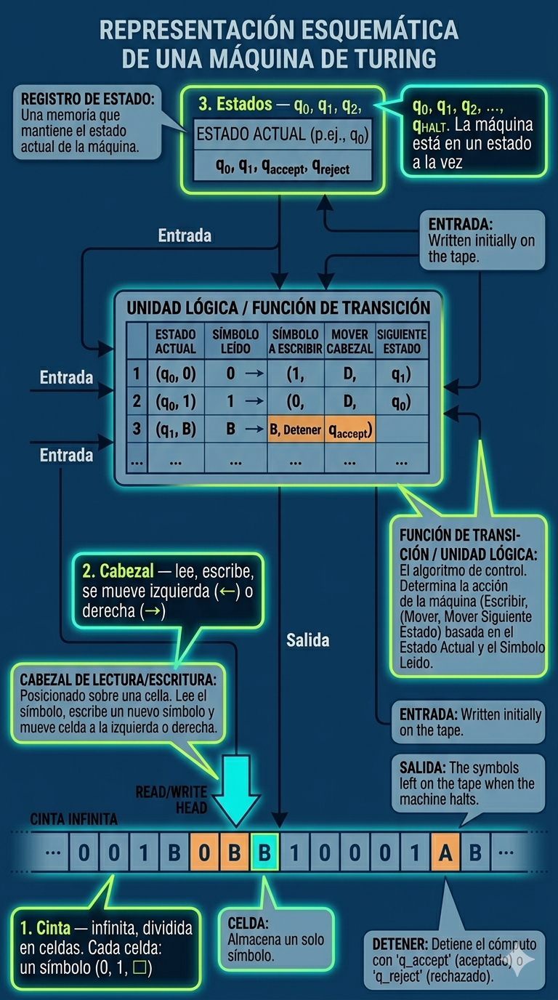

<!-- _class: lead -->
<!-- _paginate: false -->

# La Máquina de Turing
## El computador universal más simple

*Introducción al Análisis de Datos y Programación*


*Laboratorio de Ecoinformática*
*Instituto de Conservación, Biodiversidad y Territorio - Facultad de Ciencias Forestales y Recursos Naturales · UACh*

---

# ... de la semana pasada

- Un **algoritmo** es un procedimiento finito, definido, efectivo
- Se expresa como pseudocódigo o diagrama de flujo
- La **complejidad** mide cuánto cuesta ejecutarlo

### **Hoy:** 
si un algoritmo es una receta, ¿existe una "cocina universal" que pueda ejecutar *cualquier* receta?

---

<!-- _class: pregunta -->

# 🤔 En la primera semana, vimos que un computador tiene CPU, memoria y E/S.

# ¿Cuántas de esas partes se pueden eliminar y seguir "computando"?

---

# La respuesta de Turing: casi todas

En 1936, un matemático de 24 años demostró que la máquina de computar más simple posible solo necesita:

1. Una **cinta** (memoria)
2. Un **cabezal** (lee y escribe)
3. Unos **estados** (memoria interna mínima)
4. Una **tabla de reglas** (el programa)

Y con eso puede computar **todo lo que es computable**.

---

<!-- _class: invert -->

# Alan Turing (1912–1954)

---
<!-- _footer: "" -->
# Alan Turing


<!--
<div class="img-placeholder">
📎 IMAGEN: Retrato de Alan Turing (foto de 1951, dominio público) o la estatua de Turing en Manchester. Buscar: "Alan Turing portrait 1951" o "Alan Turing statue Manchester Sackville Park".
</div>
-->

- Matemático británico. A los **24 años** publica el paper que funda la informática teórica.
- WWII: lideró el equipo que descifró **Enigma** en Bletchley Park.
- 1950: propone el **Test de Turing** — ¿puede una máquina imitar a un humano?
- Perseguido por su homosexualidad. Murió en 1954. El gobierno británico se disculpó en 2009.

---
<style scoped> {font-size:30px}</style>

# ¿Qué resolvió Alan T.?

En 1928, David Hilbert preguntó:

> *"¿Existe un procedimiento mecánico que determine, para cualquier enunciado matemático, si es verdadero o falso?"*

[ $:\rightarrow$ 23 problemas *no-resueltos* que dan forman a matemáticas del S. XX   ]

Hilbert esperaba que sí — un **algoritmo universal para toda la matemática**.

Turing demostró que **no**. Pero para eso, primero necesitó definir con precisión qué es un "procedimiento mecánico".

Y ahí nació la Máquina de Turing.

---

<!-- _class: invert -->

# El modelo
## Las cuatro partes de la Máquina de Turing

---
<!-- _footer: ""-->
<!-- _paginate: false -->
# Componentes



<!--
<div class="img-placeholder">
📎 IMAGEN: Diagrama esquemático de una Máquina de Turing — cinta dividida en celdas (con símbolos), un cabezal con flecha señalando una celda, y una caja "Control" con el estado actual. Buscar: "Turing machine diagram schematic" en Wikimedia Commons. O dibujar uno simple en Excalidraw: cinta horizontal, cabezal como triángulo apuntando hacia abajo, caja de estados al costado.
</div>
-->

**1. Cinta** — infinita, dividida en celdas. Cada celda: un símbolo (0, 1, □)
**2. Cabezal** — lee, escribe, se mueve izquierda (←) o derecha (→)
**3. Estados** — q0, q1, q2, ..., qHALT. La máquina está en un estado a la vez
**4. Tabla de transiciones** — las instrucciones: (estado, símbolo) → (escribir, mover, nuevo estado)


---


---
# Comparación con la Semana 1

| Computador Humano (Sem. 1)          | Máquina de Turing        |
|-------------------------------------|--------------------------|
| Memoria (10 celdas)                 | Cinta (infinitas celdas) |
| ALU (calcula)                       | Cabezal (lee/escribe)    |
| Unidad de Control (lee tarjetas)    | Tabla de transiciones    |
| Programador/a (escribe el programa) | Quien diseña la tabla    |
| Tarjetas de instrucciones | Filas de la tabla |

> Es el **mismo modelo**, pero reducido a su mínima expresión.

---
<!-- _footer: "" -->


---
<!-- _footer: "" -->

# ¿Cómo funciona?

Un ciclo que se repite hasta llegar a qHALT:

<div class="cols">

```
1. El cabezal LEE el símbolo de la celda actual
2. Busca en la tabla: (estado actual, símbolo leído) → ...
3. ESCRIBE el nuevo símbolo en la celda
4. Se MUEVE una posición (← o →)
5. CAMBIA al nuevo estado
6. Repetir desde 1
```


</div>
Cada fila de la tabla tiene la forma:

**(estado, lee) → (escribe, mueve, nuevo estado)**

---

<!-- _class: invert -->

# Ejemplo paso a paso
## Sumar 1 a un número binario

---

# El problema

**Entrada:** el número binario `1011` (= 11 en decimal)
**Salida esperada:** `1100` (= 12 en decimal)

La cinta empieza así:


```
... □  □  □  1  0  1  1  □  □  □ ...
                  ↑
               cabezal (estado q0)
```


---
<style scoped>{font-size:30px}</style>

# La tabla de transiciones (el "programa")

| Estado | Lee | Escribe | Mueve | Nuevo estado | Comentario |
|---|---|---|---|---|---|
| q0 | 0 | 0 | → | q0 | Avanzar al final |
| q0 | 1 | 1 | → | q0 | Avanzar al final |
| q0 | □ | □ | ← | q1 | Llegó al final, retroceder |
| q1 | 0 | 1 | ← | q2 | Sumar: 0→1, terminó el carry |
| q1 | 1 | 0 | ← | q1 | Carry: 1→0, seguir propagando |
| q1 | □ | 1 | ← | q2 | Carry al inicio: agregar 1 |
| q2 | 0 | 0 | ← | q2 | Volver al inicio |
| q2 | 1 | 1 | ← | q2 | Volver al inicio |
| q2 | □ | □ | → | qHALT | Terminó |

**Tres fases:** q0 = ir al final, q1 = sumar con carry, q2 = volver al inicio.

---
 
# Antes de ejecutar: ¿qué es el "carry"?
 
En decimal, cuando suman 7 + 5 = 12, escriben el **2** y **"acarrean" el 1** a la columna siguiente. El carry es el **desborde** que no cabe en la posición actual.
 
En binario, el desborde ocurre cada vez que sumamos **1 + 1**:
 
| Operación | Resultado | Escribo | Carry |
|---|---|---|---|
| 0 + 1 | 1 | **1** | nada (listo) |
| 1 + 1 | 10 (= "dos" en binario) | **0** | **1** a la columna izquierda |
 
---
 
# Antes de ejecutar: ¿qué es el "carry"?

Solo dos reglas. Tracemos `1011 + 1` columna por columna, de derecha a izquierda:
 
```
Columna:         [1]  [0]  [1]  [1]     ← entrada: 1011
                               + 1
 
Paso 1 (derecha): 1+1        = 10  → escribo 0, carry 1   →  _ _ _ 0
Paso 2:           1+1(carry) = 10  → escribo 0, carry 1   →  _ _ 0 0
Paso 3:           0+1(carry) = 1   → escribo 1, SIN carry →  _ 1 0 0
Paso 4 (izq):     1+0        = 1   → escribo 1 (intacto)  →  1 1 0 0  ✅
```
 
> Piense en el "carry" como una **ola** que viaja hacia la izquierda hasta encontrar un 0 que la absorba.
 
---
<style scoped>{font-size:28px}</style>
<!-- _footer: "" -->
 

# El carry en la Máquina de Turing: el estado ES la memoria
 
La MT no tiene una variable llamada "carry". No la necesita. **El estado q1 es el carry.**
 
| Estado | Lee | Escribe | Mueve | Nuevo estado | ¿Qué pasa? |
|---|---|---|---|---|---|
| q1 | 1 | 0 | ← | **q1** | 1+1=10: escribo 0, carry sobrevive → **sigo en q1** |
| q1 | 0 | 1 | ← | **q2** | 0+1=1: escribo 1, carry absorbido → **salgo de q1** |
| q1 | □ | 1 | ← | **q2** | Carry llega más allá del número → escribo un 1 nuevo |
 
**Estar en q1** = "estoy reteniendo un carry — sin anotarlo en la cinta"
**Pasar a q2** = "carry resuelto, volver al inicio"
 
> Es como sumar con un amigo: ustedes dicen *"escribí 0, acarreo 1"* y retienen el carry **en la cabeza**, sin anotarlo. La MT hace lo mismo — pero su "cabeza" es el estado.
 
**Grupo 2** (entrada `0111`) verá el carry propagarse **tres pasos seguidos** (1→0, 1→0, 1→0) antes de que el 0 lo absorba. Van a ver la ola viajar por la cinta.
 


---

# Ejecución: fase q0 (ir al final)

```
q0: □ □ □ [1] 0  1  1  □   Lee 1 → escribe 1, →, q0
q0: □ □ □  1 [0] 1  1  □   Lee 0 → escribe 0, →, q0
q0: □ □ □  1  0 [1] 1  □   Lee 1 → escribe 1, →, q0
q0: □ □ □  1  0  1 [1] □   Lee 1 → escribe 1, →, q0
q0: □ □ □  1  0  1  1 [□]  Lee □ → escribe □, ←, q1
```

El cabezal recorrió toda la entrada y ahora está al final, en estado **q1**.


---

# Ejecución: fase q1 (sumar con carry)

```
q1: □ □ □  1  0  1 [1] □   Lee 1 → escribe 0, ←, q1  ¡carry!
q1: □ □ □  1  0 [1] 0  □   Lee 1 → escribe 0, ←, q1  ¡carry!
q1: □ □ □  1 [0] 0  0  □   Lee 0 → escribe 1, ←, q2  carry terminó
```

El bit menos significativo era 1 → se convierte en 0, carry al siguiente.
Ese también era 1 → 0, carry sigue.
El siguiente era 0 → se convierte en 1, carry se absorbe. → Estado **q2**.

---

# Ejecución: fase q2 (volver al inicio)

```
q2: □ □ □ [1] 1  0  0  □   Lee 1 → escribe 1, ←, q2
q2: □ □ [□] 1  1  0  0  □   Lee □ → escribe □, →, qHALT
```

**Resultado en la cinta:**

```
... □  □  □  1  1  0  0  □  □  □ ...
```

`1100` en binario = **12** en decimal. ✅ Correcto: 11 + 1 = 12.

---

<!-- _class: pregunta -->

# 🤔 ¿El cabezal "sabía" que estaba sumando?

*No. Solo leía y seguía reglas. El "significado" — que esto es una suma — existe solo en la mente de quien diseñó la tabla.*

*Igual que en la Semana 1: la ALU no sabía que calculaba una densidad.*

---

<!-- _class: invert -->

# La tesis de Church-Turing

---
<!-- _footer: "" -->

# 🧮La afirmación más importante de la informática 


> **Tesis de Church-Turing:** Todo lo que es "computable" (en cualquier sentido razonable) puede ser computado por una Máquina de Turing.

- Tu laptop, tu celular, un supercomputador: pueden computar **exactamente las mismas cosas** que una MT.
- La diferencia es solo de **velocidad**, no de capacidad.
- Si la MT no puede resolver un problema, **nada puede**.

<hr />

<small>
Curiosidad matemática: <em>"No es un teorema"</em> (no se puede probar formalmente) — es una tesis que nadie ha refutado en casi 90 años
</small>

---
<style scopes>{font-size: 32px}</style>

# ¿Qué significa en la práctica?
<!-- _paginate: false -->
<!-- _footer: "" -->

<!-- 
<div class="img-placeholder">
📎 IMAGEN: Comparación visual entre una MT (cinta de papel con cabezal) y un data center moderno (filas de servidores). El contraste visual es dramático: la MT cabe en una mesa, el data center ocupa un edificio. Pero computan lo mismo. Buscar: "Turing machine vs modern computer" o poner una foto de un data center (Google/AWS) al lado de un diagrama de MT.
</div>
-->


Todo computador — desde una calculadora hasta un cluster de IA — es equivalente a una MT.

La diferencia:
- MT: correcta pero **absurdamente lenta**
- Computador moderno: la misma lógica, **billones de veces más rápido**

> Es como comparar caminar vs. volar: el destino es el mismo, pero el tiempo cambia todo.

---

<!-- _class: invert -->

# Lo no computable
## El problema de la detención

---

# Hay cosas que no se pueden computar

Turing demostró que **ninguna** MT puede resolver el siguiente problema:

> **Problema de la detención:** Dado un programa cualquiera y una entrada, ¿se puede determinar si el programa terminará (HALT) o correrá para siempre?

La respuesta es **no** — no existe un algoritmo general que resuelva esto.

---

# ¿Por qué importa?
<!--
<div class="img-placeholder">
📎 IMAGEN: Diagrama de "computability map" — un círculo grande que dice "Todos los problemas", dentro un círculo mediano "Problemas decidibles (computables)", dentro un pequeño "Problemas tratables (eficientes)". El problema de la detención está FUERA del círculo decidible. Buscar: "computability decidability diagram" o dibujar uno propio con tres círculos concéntricos.
</div>
-->

<!-- _footer: "" -->

Hay **límites fundamentales** a lo que la computación puede resolver.


---

## No todo problema tiene solución algorítmica — por más poder de cómputo que se tenga.

<div class="cols" >


> *"¿Se puede predecir con certeza si una especie se extinguirá?"* — Probablemente no (sistema caótico). Pero sí se puede **estimar la probabilidad**. La diferencia entre "resolver" y "estimar" es una lección de la teoría de la computabilidad.
</div>

---

<!-- _class: invert -->

# ¿Por qué importa la MT hoy?

---
<!-- _paginate: false -->
<style scoped>  {font-size: 28px;} </style>

# Tres razones

**1. Es el fundamento teórico de toda la informática.**
Cada lenguaje de programación, cada sistema operativo, cada IA es equivalente a una MT.

**2. Define los límites de lo computable.**
Saber qué NO se puede resolver es tan valioso como saber resolverlo.

**3. Es la base para pensar sobre la IA.**
La Semana 6 preguntaremos: *"¿Puede una máquina pensar?"*
Turing formuló esta pregunta en 1950 — y la MT es el modelo mental que necesitan para discutirla con rigor.


<!--
<div class="img-placeholder">
📎 IMAGEN: Portada del paper de Turing (1950) "Computing Machinery and Intelligence" — donde propone el Test de Turing. O un diagrama del Test de Turing (juez humano, computador, humano detrás de pantallas). Buscar: "Turing test diagram" o "Computing Machinery and Intelligence 1950 cover".
</div>
-->

---


---

<!-- _class: invert -->

# Complejidad vs. Computabilidad
## Dos preguntas distintas sobre un mismo problema

---
<style scoped>  {font-size: 24px;} </style>
<!-- _footer: "" -->


# 🗺️La metáfora del explorador

Imaginen todos los problemas como un **territorio**. Ustedes son exploradores y hacen dos preguntas, en orden:

<div class="cols">

<div>

**Pregunta 1 — Computabilidad (Turing):**
*"¿Puedo llegar a este destino? ¿Existe un camino?"*

**Pregunta 2 — Complejidad (Big-O):**
*"Si puedo llegar, ¿cuánto cuesta el viaje?"*

</div>


</div>

> La primera pregunta es de **existencia**: ¿hay solución o no? La segunda es de **costo**: ¿me alcanza la vida para encontrarla?

Son preguntas diferentes. Y la confusión entre ambas es uno de los errores más comunes en computación.

---

# Hay tres zonas a evlauar, no dos

| Zona | Pregunta que responde | Ejemplo | Situación |
|---|---|---|---|
| **Tratable** | Resoluble Y costeable | Ordenar una lista: O(n log n) | Lo hacemos rutinariamente |
| **Intratable** | Resoluble PERO incosteable | Red óptima de reservas para 500 sitios: O(2ⁿ) | El camino existe, pero el universo se acaba antes de recorrerlo |
| **No computable** | No existe solución | Problema de la detención | No hay camino. Punto. |

> La confusión típica: pensar que **intratable** y **no computable** son lo mismo. No lo son. Lo intratable es carísimo pero posible. Lo no computable es **imposible**, sin importar los recursos.

---

# El error que no deben cometer

**"Es demasiado difícil, entonces es imposible"** ← FALSO

- O(2ⁿ) es **absurdamente caro**. Pero un algoritmo O(2ⁿ) **dará** la respuesta si esperan suficiente tiempo.
- El Halting Problem **no tiene algoritmo**. No es cuestión de esperar. No es cuestión de computadores más rápidos. No existe procedimiento — ni ahora, ni nunca.

La diferencia es entre:
- **"No me alcanza la plata para el pasaje"** (intratable)
- **"El destino no existe en ningún mapa"** (no computable)

---

<!-- _class: pregunta -->

# Un ejemplo de su futuro profesional

---
<style scoped>  {font-size: 28px;} </style>


#

# Diseñar una red de áreas protegidas

**Problema:** *"Seleccionar el conjunto mínimo de sitios que proteja las 500 especies de una región."*

Esto es el **problema de cobertura de conjuntos** — NP-difícil, esencialmente O(2ⁿ).

Con 500 sitios candidatos: 2⁵⁰⁰ combinaciones posibles.

Ese número tiene **150 dígitos**. Si cada átomo del universo fuera un computador evaluando una combinación por nanosegundo desde el Big Bang, **todavía no habrían terminado**.

> Pero el problema **SÍ es computable**. La solución existe. El problema es que nadie puede encontrarla por fuerza bruta.

---
<!-- _footer: "" -->

# ¿Qué hacen los Ing. en Conservación de Recursos Naturales?

Usan **algoritmos heurísticos** — como Marxan o Zonation.

No garantizan la solución **óptima**, pero encuentran una solución **"suficientemente buena"** en tiempo razonable (O(n²) o O(n³)).

**Se hace un compromiso:** si bien pierde optimalidad, gana tratabilidad. *<small>(no será solución óptima, pero si puede hacer una recomendación en tiepo razonable!)</small>*

> Esto es ingeniería algorítmica aplicada a la conservación. Y es exactamente la lógica de la Semana 4: elegir el algoritmo adecuado + el presupuesto computacional disponible para resolver el problema.

---

# Ahora comparen con el Halting Problem

*"Escriba un programa que determine si cualquier corrida de Marxan va a terminar."* - <small>encontrar red óptima de sitios que maximiza la protección de especies</small>

**NO** es cuestión de esperar más o tener un computador más rápido.

Turing demostró que **no existe algoritmo** que resuelva esto en general.

| Diseño de red óptima | Halting Problem |
|---|---|
| O(2ⁿ) — costosísimo pero computable | No computable — no hay algoritmo |
| Heurísticas dan soluciones "buenas" | No hay atajos. No hay heurísticas |
| Problema de **presupuesto** | Problema de **existencia** |

---
<!-- _footer: "" -->

# El mapa completo

```
FÁCIL ────────────────────────── DIFÍCIL ───────────── IMPOSIBLE
 │                                  │                       │
 O(1)   O(log n)  O(n)  O(n log n)  O(n²)    O(2ⁿ)    ║  No existe
 │        │        │       │         │         │      ║  algoritmo
 │        │        │       │         │         │      ║
Leer    Búsqueda  Recorrer Merge   Burbuja  Fuerza    ║  Halting
primer  binaria   lista    sort    sort     bruta     ║  Problem
elem.   (Sem. 3)                            reservas  ║
 │        │        │       │         │         │      ║
 ◄──────── COMPLEJIDAD (Sem. 4) ──────────────►║◄─ COMPUTABILIDAD (Sem. 5)─►
           "¿Cuánto cuesta?"                   ║   "¿Es posible?"
                                               ║
                                          Barrera de
                                            Turing
```

Todo a la izquierda de la línea: **computable** (unos fáciles, otros imposiblemente caros).
Todo a la derecha: **fundamentalmente fuera de alcance**.

---
<style scoped>  {font-size: 28px;} </style>

# ¿Y qué tiene que ver con la IA?

Cuando usen un LLM y parezca "resolver" un problema complejo, pregunten:

**¿Dónde está este problema en el mapa?**

- **Zona tratable** → el LLM probablemente tiene buenos datos de entrenamiento. La respuesta puede ser razonable.
- **Zona intratable** → el LLM está usando aproximaciones (o alucinando una respuesta plausible que es incorrecta).
- **Cerca de la barrera** → ningún LLM, ningún computador, ninguna tecnología futura lo resolverá exactamente. Lo mejor será **estimar**.

> Saber **dónde** está un problema en este mapa determina qué herramientas son apropiadas. *Esa intuición les va a servir toda la carrera*.

---

<!-- _class: pregunta -->

# Resumen en una frase

La **complejidad** pregunta cuánto cuesta llegar.
La **computabilidad** pregunta si se puede llegar.

## 
Big-O mide las distancias dentro de él.
La Máquina de Turing dibujó el mapa.


---

# Lo que aprendimos hoy

- La **Máquina de Turing** tiene solo 4 partes: cinta, cabezal, estados, tabla de transiciones
- Es el **modelo mínimo** de computación — pero puede computar todo lo que cualquier computador puede
- La **tesis de Church-Turing**: todo lo computable puede ser computado por una MT
- Hay problemas **no computables** (como el problema de la detención)
- La MT no "entiende" — sigue reglas. El significado vive en el diseño del programa

---

# Próxima semana

## Semana 6 · Del perceptrón a ChatGPT
### ¿Qué son los LLMs? -·- (*Large Language Models*)


<div class="cols">

<div class="card">
Si una MT no "piensa" pero puede computar todo... ¿qué está haciendo un LLM cuando responde a tu pregunta? ¿Y qué significa eso para la conservación?
</div>


</div

---

<!-- _class: lead -->
<!-- _paginate: false -->

# vamos al práctico