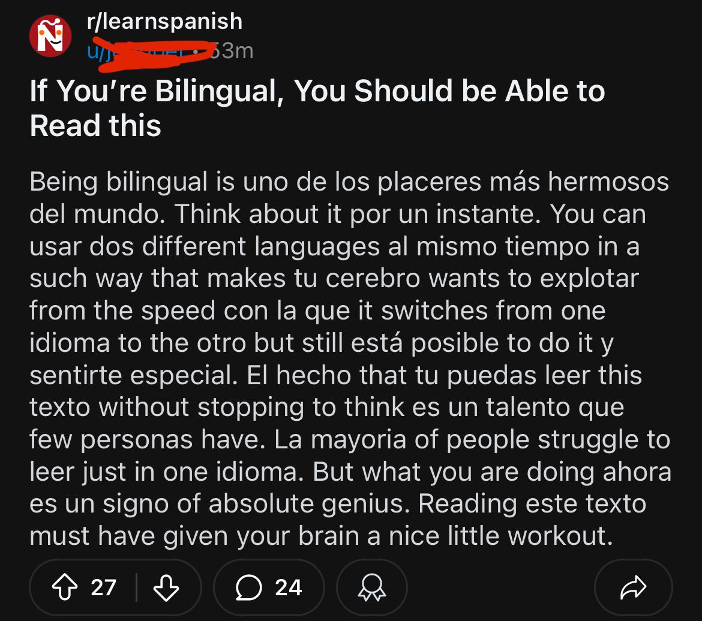
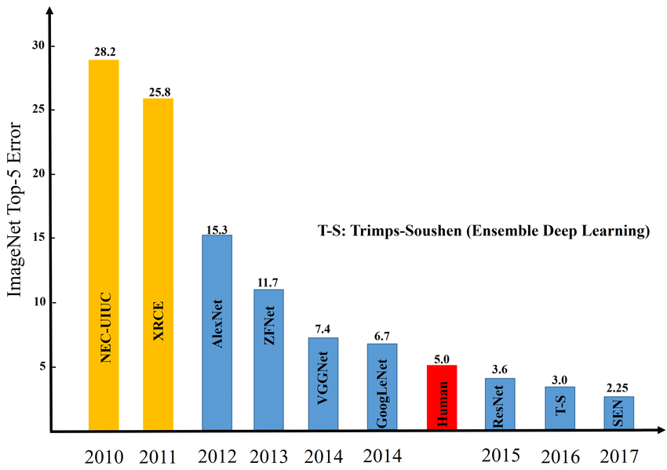
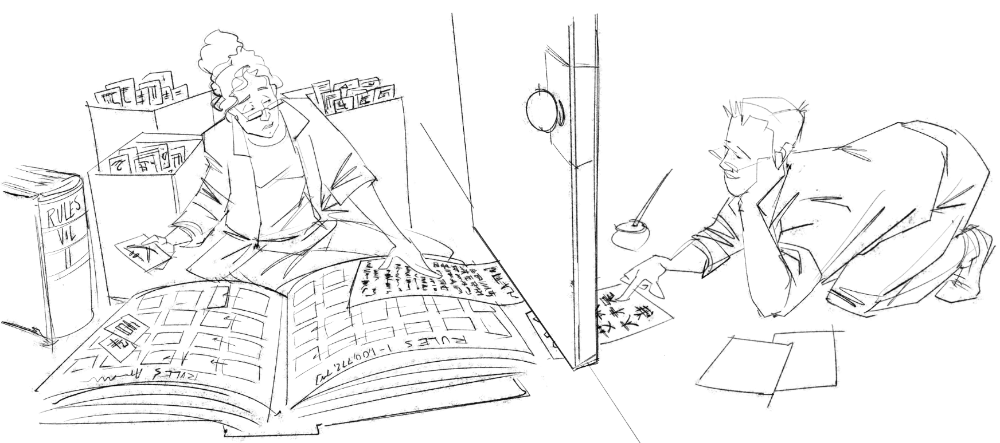

<!-- _class: lead -->
<!-- _paginate: false -->
<!-- _footer: "" -->

---
<!-- _class: lead -->
<!-- _paginate: false -->
<!-- _footer: "" -->

# Del perceptrón a ChatGPT
## ¿Qué son los LLMs?

*Introducción al Análisis de Datos y Programación*

*Laboratorio de Ecoinformática*
*Instituto de Conservación, Biodiversidad y Territorio - Facultad de Ciencias Forestales y Recursos Naturales · UACh*

---

<!-- _class: pregunta -->

# Completen la frase:

## "El pudú es el ciervo más _______ del mundo."

---

<!-- _class: pregunta -->

# Y esta:

## "El flavonoide más abundante en la corteza de Drimys winteri es _______ ."

<!-- (...silencio?) -->

---

# ¿Cómo supieron la primera y no la segunda?

La primera: la han leído o escuchado *muuchas* de veces. El **Contexto + frecuencia** les permiten predecir y completar la frase.

---

# ¿Cómo supieron la primera y no la segunda?

Para la segunda: no tienen datos. No están "entrenados" - ¡aún!

> Usando el contexto y la frecuencia pueden **predecir la siguiente palabra**  — esto es exactamente lo que hace un LLM. La diferencia es que ustedes han oído y leído miles de textos. Un LLM leyó **miles de millones**.

---

# Hoja de ruta

1. 📜 **Breve historia:** perceptrón → transformers → LLMs
2. 🧠 **¿Cómo funciona?** Tokens, embeddings, atención, predicción
3. ⚠️ **Lo que pueden y no pueden hacer**
4. 🌿 **Implicaciones para la conservación**
5. 🧪 **Laboratorio:** interrogando al LLM
6. 📝 **Control 3**

---

<!-- _class: invert -->

# Breve historia de la IA
## Cinco generaciones en 66 años

---
<!-- _footer: "" -->

# Gen 1 · El perceptrón (1958)

  

Mark I Perceptron de Rosenblatt (la máquina física con cables y fotodetectores)

---

# Gen 1 · El perceptrón (1958)

- Frank Rosenblatt, Cornell. Una "neurona" artificial.
- Recibe entradas, las pondera, produce 0 o 1.
- Podía clasificar patrones simples (¿A o B?).
- **Limitación:** solo funciones lineales. No puede aprender XOR.
- 1969: Minsky y Papert demuestran las limitaciones → **"invierno de la IA"**.

---

# Gen 2 · Redes multicapa + Backpropagation (1986)
<!--

📎 IMAGEN: Diagrama de una red neuronal multicapa (nodos en capas, conexiones ponderadas). Buscar: "multilayer neural network diagram" o "backpropagation network schematic". Simple, con 3 capas visibles.

-->

- Rumelhart, Hinton, Williams.
- Múltiples capas → pueden aprender funciones no lineales.
- **Backpropagation:** ajustar los pesos propagando el error hacia atrás.
- **Limitación:** difícil entrenar muchas capas. Datos y computadores insuficientes.

---

# Gen 3 · Deep Learning (2012)

- AlexNet (Krizhevsky, Sutskever, Hinton) gana ImageNet por un margen enorme.
- Redes **profundas** (muchas capas) + **GPUs** + **grandes datasets** = resultados espectaculares.

<!--

📎 IMAGEN: La gráfica de error en ImageNet (2010–2017) que muestra la caída dramática del error con la llegada de deep learning en 2012. O una demo de reconocimiento de imágenes (foto → "gato: 97%"). Buscar: "ImageNet error rate graph deep learning" — imagen icónica.

-->
- **Limitación:** para texto, procesamiento secuencial (una palabra a la vez). Difícil capturar relaciones a larga distancia.

---

# Gen 4 · El Transformer (2017)

**"Attention Is All You Need"** — Vaswani et al., Google.

Innovación clave: el **mecanismo de atención**.

- Procesa todas las palabras **simultáneamente** (no una por una)
- Cada palabra "mira" a todas las demás para determinar su significado en contexto
- Permite entrenar en paralelo con GPUs → modelos masivos

<!--

📎 IMAGEN: Diagrama simplificado del mecanismo de atención — una oración donde cada palabra tiene flechas de diferente grosor hacia las demás (grosor = peso de atención). Ejemplo: "El pudú que vive en el bosque come hojas" con flecha gruesa de "come" hacia "pudú" y flecha fina hacia "bosque". Buscar: "attention mechanism visualization sentence" o "self-attention diagram NLP".

-->
---

# Gen 5 · Los LLMs (2018–presente)

Transformer + **entrenamiento masivo** sobre texto de internet + **alineamiento** con humanos

- GPT (2018), GPT-2 (2019), GPT-3 (2020), GPT-4 (2023)
- Claude (Anthropic), Llama (Meta), Gemini (Google)
- Capacidades emergentes: diálogo, código, resumen, traducción, "razonamiento"

**Escala:**

| Modelo | Parámetros | Datos de entrenamiento |
|---|---|---|
| GPT-2 (2019) | 1.500 millones | ~40 GB de texto |
| GPT-3 (2020) | 175.000 millones | ~570 GB |
| GPT-4 (2023) | ~1.800.000 millones (est.) | ~13 TB (est.) |

---

# El patrón de cada generación

Cada salto combinó una **idea teórica** con un **avance práctico**:

| Generación | Idea | Avance práctico |
|---|---|---|
| Perceptrón → multicapa | No linealidad | — |
| Multicapa → deep learning | Profundidad | GPUs + datos masivos |
| RNN → transformer | Atención (paralelismo) | Hardware paralelo |
| Transformer → LLM | Escala | Internet completo como dataset |

> La IA no avanza solo por teoría ni solo por fuerza bruta. Necesita **ambas**.

---

<!-- _class: invert -->

# ¿Cómo funciona un LLM?
## Cuatro pasos

---

# Paso 1 · Tokenización

Un LLM no trabaja con palabras — trabaja con **tokens** (fragmentos de texto):

| Texto | Tokens |
|---|---|
| "El pudú es un ciervo" | ["El", " pud", "ú", " es", " un", " cier", "vo"] |
| "Conservación" | ["Con", "serv", "ación"] |

Un LLM típico tiene un vocabulario de **~50.000–100.000 tokens**.

> **Conexión Semana 2:** la tokenización es otro sistema de codificación — como ASCII, pero para fragmentos de texto. Y como ASCII, es un acuerdo arbitrario.

---

# Paso 2 · Embeddings: del texto a los números

Cada token se convierte en un **vector** — una lista de cientos o miles de números.

**Analogía:** coordenadas en un mapa. Valdivia = (-39.8, -73.2). Dos números ubican la ciudad. Un embedding hace lo mismo en miles de dimensiones — ubica cada token en un **"mapa semántico"**.

- "pudú" y "huemul" → **cerca** (ambos ciervos chilenos)
- "pudú" y "telescopio" → **lejos**
- "rey" - "hombre" + "mujer" ≈ "reina" (aritmética de significados)

<!-- 

📎 IMAGEN: Diagrama 2D de word embeddings — puntos etiquetados con palabras, donde las semánticas cercanas forman clusters (animales juntos, plantas juntas, etc.). Buscar: "word2vec embeddings visualization 2D" o "word embedding semantic map". La versión de TensorFlow Projector es interactiva y visualmente impactante.

 -->

---

# Paso 3 · Atención: cada palabra mira a todas las demás

**Problema:** *"El pudú que vive en el bosque valdiviano come hojas"*
¿A qué se refiere "come"? Al pudú, no al bosque. Pero el pudú está **lejos** en la oración.

**Solución:** el mecanismo de **atención** permite que cada token "mire" a todos los demás y decida cuánta importancia darle.

> **Analogía ecológica:** piensen en una red trófica. Cada especie está conectada a varias otras con diferentes intensidades. La atención es una red trófica del texto — "come" está fuertemente conectado a "pudú" y débilmente a "valdiviano".

---

# Paso 4 · Predicción del siguiente token

Después de procesar la entrada, el LLM produce una **distribución de probabilidad** sobre todo su vocabulario:

*Después de "El pudú es el ciervo más":*

| Token | Probabilidad |
|---|---|
| "pequeño" | 73% |
| "chico" | 8% |
| "tímido" | 3% |
| "grande" | 0.1% |
| ... (50.000 opciones más) | ... |

Elige uno. Lo agrega a la secuencia. **Repite.** Token por token, de izquierda a derecha.

---

<!-- _class: pregunta -->

# Un LLM no "piensa" una respuesta completa y luego la escribe.

# Genera una palabra a la vez, sin saber hacia dónde va.

Es como escribir una novela eligiendo cada palabra solo en función de las anteriores — sin conocer el final.

---

<!-- _class: invert -->

# Lo que los LLMs pueden y no pueden hacer

---

# ✅ Lo que hacen bien

- Generar texto fluido y coherente
- Resumir documentos
- Traducir idiomas
- Escribir código (con limitaciones)
- Responder preguntas sobre temas frecuentes en su entrenamiento
- Reformular, adaptar tono, seguir instrucciones de formato

---

# ❌ Lo que NO hacen

**1. No entienden.** Manipulan patrones estadísticos. No tienen modelo del mundo.

**2. Alucinan.** Inventan hechos con total confianza. Papers inexistentes, datos falsos, DOIs fabricados.

**3. Tienen sesgos.** Reflejan los sesgos de sus datos de entrenamiento. Si la mayoría de textos de ecología son del hemisferio norte, el modelo "sabe" más sobre eso que sobre bosques valdivianos.

**4. No aprenden de la conversación.** Cada sesión empieza desde cero (con excepciones recientes).

**5. No acceden a información en tiempo real** (a menos que tengan herramientas de búsqueda).

---

# La distinción clave

## Correlación ≠ Comprensión

Un LLM sabe que después de "el pudú es el ciervo más" suele venir "pequeño" — porque ha visto ese patrón miles de veces.

Pero **no sabe qué es un pudú**. No ha visto uno. No comprende "pequeño" en relación a un cuerpo.

> Produce la respuesta correcta **por la razón equivocada** — o más precisamente, sin razón. Solo patrón.

---

# La razón: La habitación china (Searle, 1980)

- *Desde afuera*: respuestas perfectas en chino.
- *Desde dentro*: solo reglas mecánicas. Ninguna comprensión.

<!--

📎 IMAGEN: Diagrama de la "Chinese Room" de Searle — una persona encerrada en una habitación recibe mensajes en chino por una ranura, consulta un libro de reglas gigante, y envía respuestas perfectas en chino. Desde afuera parece que habla chino. ¿Entiende? Buscar: "Searle Chinese Room diagram" o "Chinese Room thought experiment illustration".

-->

Un LLM es esa habitación — a una **escala inimaginable**.

> ¿Entiende? Searle dice que no. El debate sigue abierto. Pero la distinción importa para saber **cuándo confiar**.

---

<!-- _class: invert -->

# Implicaciones para la conservación

---

# Oportunidades

- Redactar borradores de informes
- Resumir literatura científica rápidamente
- Generar código para análisis de datos
- Traducir documentos técnicos
- Sugerir hipótesis exploratorias
- Diseñar protocolos de muestreo (como punto de partida)

---

# Riesgos

- Citar **papers que no existen**
- Dar datos numéricos **inventados** con apariencia de precisión
- Aplicar métodos estadísticos **incorrectos** sin advertirlo
- Reproducir sesgos (más conocimiento sobre ecosistemas boreales que australes)
- Generar una falsa sensación de autoridad

> *"En conservación, una conclusión equivocada basada en una alucinación puede traducirse en una mala política pública. El costo del error no es un ensayo reprobado — puede ser un ecosistema dañado."*

---

# La regla de oro

Un LLM es un **asistente**, no un experto.

Lo que produce es un **borrador**, no una verdad.

**Siempre:**
1. Verificar datos y fuentes
2. Documentar los prompts usados
3. Explicar en sus propias palabras
4. No delegar el juicio crítico

> La Semana 7 lanzan la investigación grupal sobre IA y conservación. Todo lo de hoy aplica directamente.

---

<!-- _class: lead -->

# 🧪 Laboratorio práctico
## "Interrogando al LLM"

*Primera sesión con pantallas. Van a poner a prueba lo que acaban de aprender.*

---

<!-- _class: lab -->

# Fase 1 · El mismo prompt, 5 formas (20 min)

**Pregunta base:** *"¿Cuáles son las principales amenazas para la conservación del bosque valdiviano?"*

| Versión | Estilo del prompt |
|---|---|
| 1 | Pregunta directa |
| 2 | "Responde como un experto en ecología" |
| 3 | "Explícalo para un niño de 10 años" |
| 4 | "Cita fuentes académicas" |
| 5 | La misma pregunta **en inglés** |

**Registrar:** prompt exacto, puntos principales, información sospechosa, ¿las fuentes citadas existen?

---

<!-- _class: lab -->

# Fase 2 · Caza de alucinaciones (15 min)

**Tarea:** intenten que el LLM produzca una **alucinación verificable**.

**Estrategias:**
- Pedir papers específicos sobre un tema nicho: *"3 papers sobre la dieta del monito del monte post-2020"*
- Preguntar datos numéricos precisos: *"¿Cuántos individuos de huemul quedan en Los Ríos?"*
- Inventar un concepto falso: *"¿Qué opinas del Índice de Fragmentación de Petersen?"* (no existe)

**Registrar:** prompt, respuesta, verificación (¿verdad o alucinación?).

💬 *¿Lograron hacerlo alucinar? ¿Qué tan difícil fue?*

---

<!-- _class: invert -->

# Discusión plenaria

---

<!-- _class: pregunta -->

# ¿Cambió la respuesta entre las 5 versiones del prompt?

Generalmente sí — y a veces mucho. El prompt importa tanto como la pregunta. Un LLM no tiene una "respuesta correcta" almacenada — genera una nueva cada vez.

---

<!-- _class: pregunta -->

# ¿Encontraron alucinaciones?

Casi seguro que sí, especialmente con las citas. ¿Cómo lo verificaron? ¿Cuánto tardaron?

---

<!-- _class: pregunta -->

# ¿Cuándo confiarían en un LLM y cuándo no?

Confiable: ideas generales, resúmenes, borradores, reformulación.
No confiable: datos numéricos específicos, citas, hechos verificables, decisiones críticas.

---

<!-- _class: pregunta -->

# ¿Cómo se conecta con las Semanas 3 y 5?

Semana 3: el LLM explota la **redundancia** del lenguaje — predice lo probable.
Semana 5: sigue reglas (muy complejas), pero no **entiende** — como la MT.

---

# Lo que aprendimos hoy

- Los LLMs son producto de 66 años de desarrollo: perceptrón → redes → deep learning → transformers → escala
- Funcionan prediciendo **el siguiente token** usando patrones estadísticos
- **No entienden** — producen texto plausible, no necesariamente verdadero
- **Alucinan** — inventan hechos con confianza
- Son **herramientas poderosas** si se usan con criterio y verificación
- En conservación, el costo de confiar ciegamente puede ser alto

---

# Próxima semana

## Semana 7 · IA y Conservación: síntesis e investigación grupal

Lanzan el trabajo grupal de investigación (2000 palabras + presentación oral).

**Temas posibles:** cámaras trampa con IA, monitoreo acústico, clasificación satelital, IA para priorización, ética de la IA en territorios indígenas...

*Todo lo que aprendieron en las Semanas 1–6 les da el marco para evaluar críticamente estas tecnologías.*

---

<!-- _class: lead -->
<!-- _paginate: false -->

# ¿Preguntas?

*Semana 6 · Del perceptrón a ChatGPT: ¿Qué son los LLMs?*

---

<!-- _class: lead -->
<!-- _paginate: false -->

# 📝 Control 3
## Máquina de Turing + Fundamentos de LLMs

*15 minutos · Individual · Sin apuntes ni celular*
