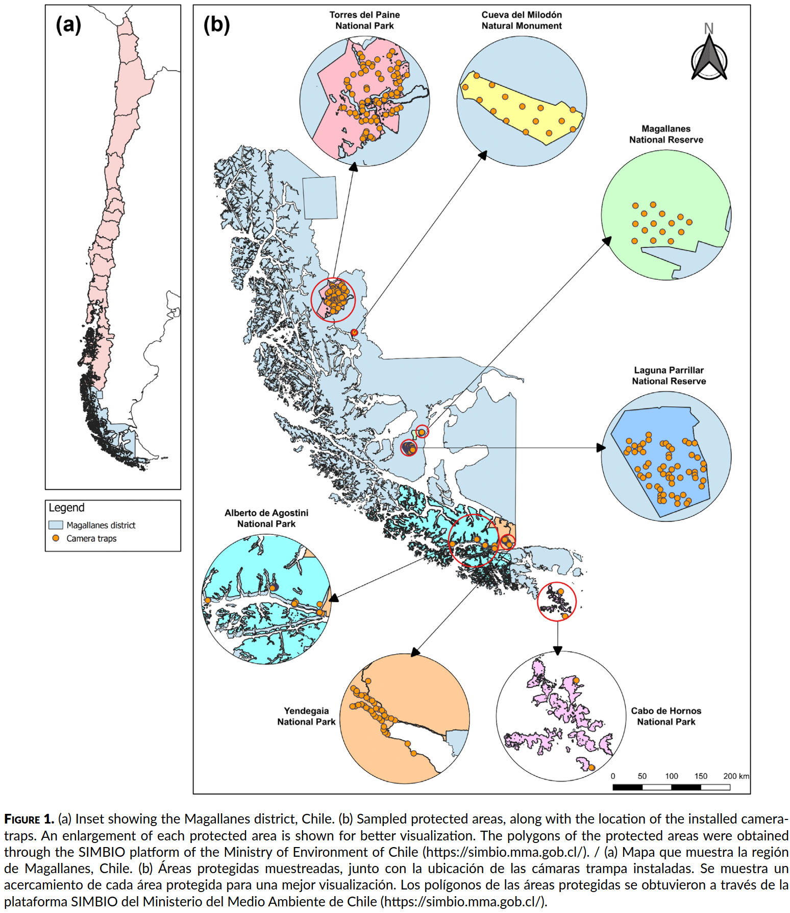
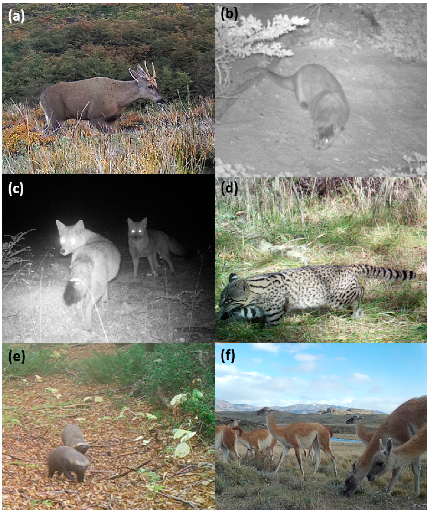
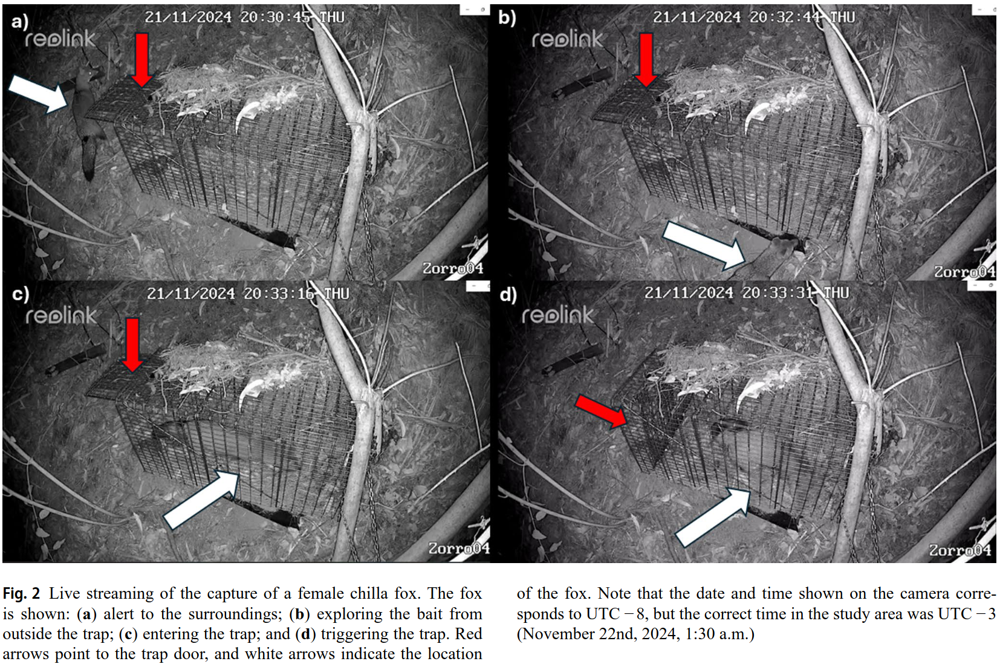
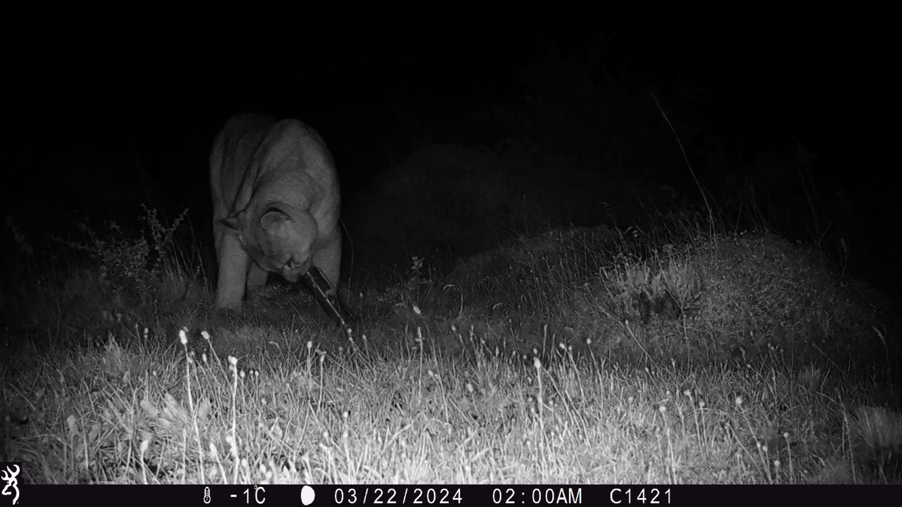
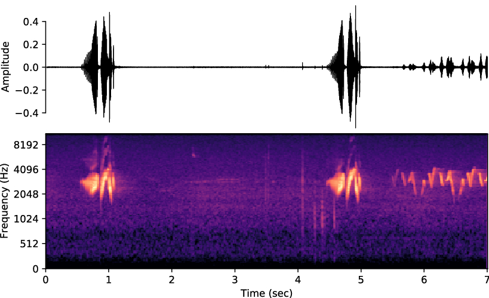
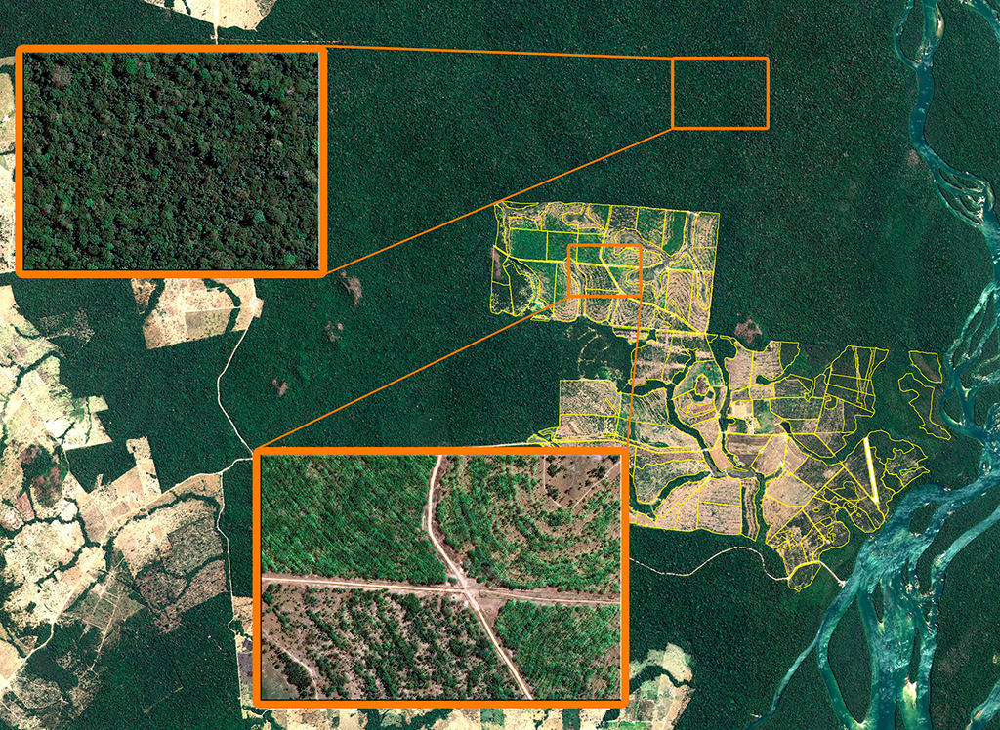
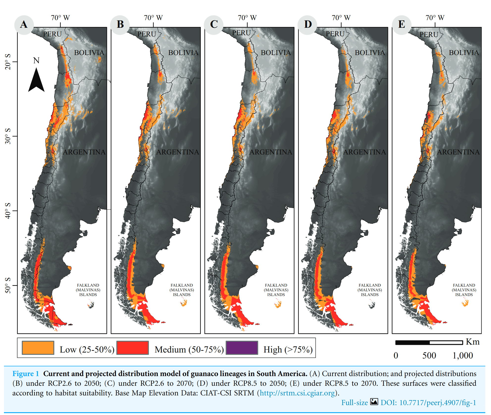
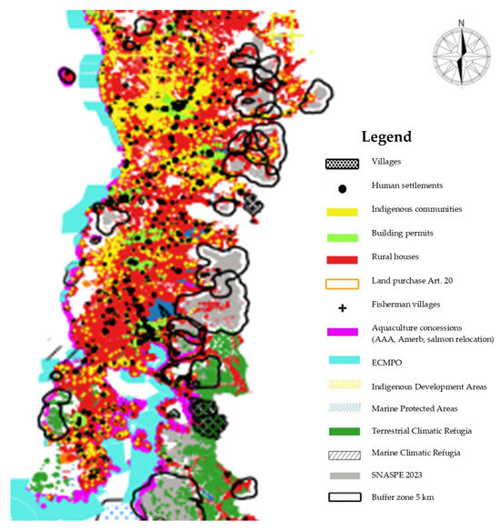
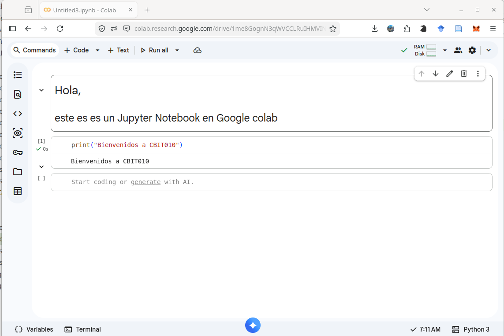

<!-- _class: lead -->
<!-- _paginate: false -->

# IA y Conservación
## Síntesis e investigación grupal

*Semana 7*
*·*
*Cierre de Sección Analógica*

---

<!-- _class: pregunta -->

# ¿Han usado alguna app que use IA para identificar especies?

*iNaturalist? Merlin? PlantNet?*

*Abran una ahora — muéstrenle una foto de un animal o planta. ¿La identifica bien?*

---

# Detrás de la identificación

Cada vez que iNaturalist dice *"esto parece un Dromiciops gliroides"*:

- Una **red neuronal** analiza los píxeles de la foto (**Sem. 2**: RGB = números)
- Los compara con millones de imágenes etiquetadas (**Sem. 6**: patrones estadísticos)
- Produce una probabilidad (**Sem. 3**: predicción basada en frecuencia)

La red **no "ve"** al monito del monte. Opera sobre números.
<!-- 

📎 IMAGEN: Screenshot de iNaturalist o Merlin identificando una especie chilena (pudú, chucao, monito del monte). Hacer un screenshot en el momento con el celular del docente y proyectarlo.

 -->

---

# Hoja de ruta

1. 🔬 **Seis aplicaciones** de IA en conservación
2. ⚖️ **Dimensiones éticas**
3. 🗺️ **Mapa conceptual** de la Sección Analógica
4. 📋 **Lanzamiento del trabajo de investigación**
5. 🔧 **Taller:** formar grupos, elegir temas, definir preguntas

---

<!-- _class: invert -->

# El estado del campo
## ¿Cuánto ha crecido la IA en conservación?

---

# Los números

- Weinstein (2018) revisó **187 aplicaciones** de visión computacional en ecología animal — organizadas en **descripción**, **conteo** e **identidad**.
- En 2025, la plataforma **Conservation AI** (Fergus et al., 2024) ha procesado más de **30 millones de imágenes**, identificado **9 millones de animales** de **88 especies**, en **900+ proyectos** globales.
- Precisión de los mejores modelos regionales: **mAP > 0.96** (donde 1.0 es perfecto).
- Pero: la precisión varía de **~38%** (mamíferos de bosque tropical) a **~99%** (peces en condiciones controladas).

> El campo ha pasado de preguntar *"¿puede la IA detectar fauna?"* a *"¿puede hacerlo con la precisión, ética y especificidad regional necesarias para cambiar la conservación?"*

---

<!-- _class: invert -->

## Literatura

- Fergus, P., Chalmers, C., Longmore, S., & Wich, S. (2024). Harnessing Artificial Intelligence for Wildlife Conservation. Conservation, 4(4), 685–702. doi: [10.3390/conservation4040041](https://doi.org/10.3390/conservation4040041)
- Nandutu, I., Atemkeng, M., & Okouma, P. (2023). Integrating AI ethics in wildlife conservation AI systems in South Africa: A review, challenges, and future research agenda. AI & SOCIETY, 38(1), 245–257. doi: [10.1007/s00146-021-01285-y](https://doi.org/10.1007/s00146-021-01285-y)
- Obisa, M. A., Too, E. C., & Osero, B. O. (2025). A Review of Artificial Intelligence, Machine Learning, and Deep Learning and Their Applications in Detecting Wildlife Animals. In P. Naidoo & M. Sibanda (Eds.), Measurement, Automation, and Control in
- Artificial Intelligence and Machine Learning (pp. 1–32). Springer Nature Switzerland. doi: [10.1007/978-3-031-91802-5_1](https://doi.org/10.1007/978-3-031-91802-5_1)
- Weinstein, B. G. (2018). A computer vision for animal ecology. Journal of Animal Ecology, 87(3), 533–545. doi: [10.1111/1365-2656.12780](https://doi.org/10.1111/1365-2656.12780)
- Silva-Rodríguez, E. A., et al. (2024). A camera-trap assessment of the native and invasive mammals present in protected areas of Magallanes, Chilean Patagonia. Gayana (Concepción), 88(1), 27–43. doi: [10.4067/S0717-65382024000100027](https://doi.org/10.4067/S0717-65382024000100027)
- Silva-Rodríguez, E. A., Jara-Díaz, J. P., Castillo, G. A., Cortés, E. I., Infante-Varela, J., & Godoy-Guinao, J. (2025). Security cameras: A tool for reducing risks and increasing selectivity in wildlife trapping. Mammalian Biology, 105(5), 675–681. [10.1007/s42991-025-00504-z](https://doi.org/10.1007/s42991-025-00504-z)

---
<!-- _footer: "" -->

 

Silva-Rodríguez, E. A., et al. (2024). Gayana, 88(1), 27–43. doi: [10.4067/S0717-65382024000100027](https://doi.org/10.4067/S0717-65382024000100027) 

---
<!-- _footer: "" -->

---

# La problemática ha cambiado
## El cuello de botella

| Época | Problema principal |
|---|---|
| ~2000 | **Recolectar** datos (pocas cámaras, drones caros) |
| ~2018 | **Analizar** datos (675K imágenes en iNaturalist; 1,2M en Zooniverse — imposibles de revisar a mano) |
| ~2025 | **Generalizar** (modelos de sabana no funcionan en bosque valdiviano) y **confiar** (¿los sesgos del modelo afectan decisiones de conservación?) |

*Para los casos presentadios aquí, pregúntense: ¿qué datos usa? ¿Qué modelo? ¿Dónde puede fallar? ¿Quién se beneficia y quién podría perjudicarse?*

---

<!-- _class: invert -->

# Seis aplicaciones de IA en conservación

---

<!-- _class: caso -->
<!-- _footer: "" -->

# Caso 1 · Cámaras trampa + Clasificación automática

**¿Qué hace?** Clasifica automáticamente miles de fotos de cámaras trampa: ¿qué especie aparece?

**¿Cómo?** Una CNNs, YOLO, SSD o Faster R-CNN (Obisa et al., 2025) entrenadas con miles de fotos etiquetadas por especie.

**Ejemplo**: **Conservation AI** (Fergus et al., 2024) — 30M imágenes, 88 especies, mAP@0.5 de **0.974** para su modelo de África Subsahariana (29 especies). Modelos ajustados por sitio durante ~1 año (*"situated learning"*).

**Limitación:** CNN entrenada en sabana africana funciona **mal** en bosque valdiviano. Sin datos locales de entrenamiento, el modelo no reconoce las especies locales.

<!-- 

📎 IMAGEN: Foto de cámara trampa con un animal (idealmente fauna chilena — pudú, puma, zorro). Si no hay foto propia, buscar: "camera trap photo Chile wildlife" o usar imágenes de Wildlife Insights.

 -->

---

<!-- _class: caso -->

# Caso 2 · Monitoreo acústico

**¿Qué hace?** Graba sonido 24/7 y detecta automáticamente qué especies están vocalizando.

**¿Cómo?** Sonido → **espectrograma** (imagen de frecuencia × tiempo) → CNN clasifica la imagen.
<!-- 

📎 IMAGEN: Un espectrograma de un canto de ave (idealmente chucao o chercán) junto a una foto de un AudioMoth. Buscar: "bird song spectrogram BirdNET" o "AudioMoth field deployment". Si tienen datos propios, generar un espectrograma con Audacity o Raven. -->

**Ejemplo:** **BirdNET** (Cornell) — 6.000+ especies. En Chile: monitoreo en parques nacionales.

**Limitación:** Funciona mal con especies silenciosas, ambientes ruidosos (viento, ríos), o cantos no representados en el dataset.

---

<!-- _class: caso -->

# Caso 3 · Teledetección y uso de suelo

**¿Qué hace?** Clasifica imágenes satelitales: bosque nativo, plantación, pradera, urbano, agua...

**¿Cómo?** Cada píxel tiene valores en múltiples bandas espectrales. Un clasificador asigna categorías por "firma espectral".

**Ejemplo:** Mapa de cambio de uso de suelo de Chile (CONAF / UACh) — Landsat + clasificación supervisada.

<!-- 

📎 IMAGEN: Imagen satelital de la región de Los Ríos mostrando una clasificación de uso de suelo (bosque nativo en verde, plantaciones en verde claro, urbano en gris). Buscar en Copernicus Browser, o usar mapas de cambio de uso de suelo de CONAF/UACh (Echeverría et al.). -->

**Limitación:** La clasificación es tan buena como los **datos de entrenamiento en terreno**. Nubes = ruido (**Sem. 3**). Resolución Landsat (30m) no distingue árboles individuales.

---

<!-- _footer: "" -->
<!-- _class: caso -->

# Caso 4 · Modelos de distribución de especies

**¿Qué hace?** Predice dónde es probable encontrar una especie, basándose en clima, topografía, vegetación.

**¿Cómo?** Modelos como MaxEnt reciben registros de presencia + capas ambientales → aprenden la relación → proyectan a otras áreas o escenarios futuros.

**Ejemplo:** Distribución del guanaco bajo cambio climático en Patagonia.

:$\rightarrow$ Castillo et al. (2018) [10.7717/peerj.4907](https://doi.org/10.7717/peerj.4907)

**Limitación:** Correlación ≠ causalidad (**Sem. 6**). El modelo no sabe que el área predicha está llena de ganado o que no hay conectividad.

---

<!-- _class: caso -->
<!-- _footer: "" -->

# Caso 5 · Predicción de caza furtiva + Detección en tiempo real

**¿Qué hace?** Dos enfoques: (1) predecir dónde ocurrirá caza furtiva → optimizar patrullajes. (2) Detectar intrusos en tiempo real → alertar guardaparques.

**¿Cómo?** **PAWS** aprende modelos de comportamiento de cazadores a partir de datos históricos y sugiere rutas de patrullaje. **TrailGuard AI** (Resolve + Intel) usa IA en el dispositivo para detectar humanos/vehículos y enviar alertas instantáneas (Nandutu et al., 2023).

<!-- 

📎 IMAGEN: Mapa de riesgo de caza furtiva con celdas coloreadas (rojo = alto riesgo, verde = bajo). Buscar: "PAWS poaching prediction map" o "anti-poaching AI heat map".

 -->

**Ejemplo:** Conservation AI (Fergus et al., 2024) logró **condenas y sentencias de cárcel** gracias a detecciones en tiempo real — en Uganda (pangolines) y UK (tejones). Una cámara robada siguió transmitiendo sin que los cazadores lo supieran.

**Limitación:** Sesgo de observación — se registran más incidentes donde hay más patrullajes → sesgo idéntico a la **detección imperfecta** (**Sem. 3**).

---

# Caso 6 · Dimensiones éticas

Nandutu et al. (2023): *"La integración de la ética de la IA en los sistemas de conservación ha recibido poca atención."* La mayoría de las herramientas se enfocan en precisión técnica sin un marco ético explícito.

---

<!-- _class: etica -->
<!-- _footer: "" -->

# Soberanía de datos

- ¿Quién es *dueño* de los datos de biodiversidad recopilados?
  - ¿Cómo cambia cuando se recopilan datos en territorios/comunidades indígenas?
  - ¿En propiedad privada? 
- ¿Quién decide cómo se usan?

En Sudáfrica, GBIF exige licenciamiento; el Endangered Wildlife Trust requiere respeto por embargos. Pero no todos los países tienen estas protecciones (Nandutu et al., 2023).

Ospina, G. (2025). Colonizing the Anthropocene Refugia? Human Settlements Within and Around Wild Protected Areas in Southern Chile. Wild, 2(1), 2. doi: [10.3390/wild2010002](https://doi.org/10.3390/wild2010002)

<!-- 

📎 IMAGEN: Foto de comunidad indígena en territorio del sur de Chile (Mapuche, Huilliche), o mapa de territorios indígenas superpuesto con áreas protegidas. Buscar: "pueblos originarios sur Chile territorio" o "indigenous territory protected areas overlap Chile". Usar con respeto y contexto.

 -->

---

<!-- _class: etica -->

# Ciber-caza furtiva

Un riesgo emergente: cazadores furtivos **hackean etiquetas GPS** y roban datos geoespaciales para rastrear y matar animales (Nandutu et al., 2023).

La transparencia que beneficia a la ciencia — datos abiertos, ubicaciones en tiempo real — puede convertirse en **arma contra la fauna**.

> La misma tecnología que protege puede ser usada para dañar. La seguridad de los datos no es un detalle técnico — es una cuestión de vida o muerte para las especies.
---

<!-- _class: etica -->
<!-- _footer: "" -->

# Sesgo algorítmico en priorización

Si Marxan o Zonation optimizan biodiversidad **sin considerar derechos territoriales** de comunidades locales...

¿Están haciendo conservación o **colonialismo verde**?

Fergus et al. (2024) identifican múltiples tipos de sesgo: de **datos** (muestras no representativas), **algorítmico** (diseño del modelo), **cultural** (prioridades de conservación del Norte Global), **temporal** (modelos desactualizados) y de **presentación** (cómo se interpretan los resultados).

> La IA no es neutra. Toda herramienta incorpora los valores de quien la diseña y los sesgos de los datos que la alimentan.

---

<!-- _class: etica -->

# Vigilancia y privacidad

Cámaras trampa y sensores acústicos diseñados para detectar fauna **también pueden monitorear personas**.

En Sudáfrica, el uso de drones dentro de parques nacionales está **prohibido** sin autorización (Nandutu et al., 2023). Los collares GPS pueden alterar el comportamiento animal.

¿Quién controla esos datos? ¿Quién tiene acceso? ¿Hay consentimiento?

> Evaluar los aspectos éticos de una herramienta de IA es **tan importante** como evaluar su precisión técnica.

---

<!-- _class: invert -->

# El mapa de la Sección 1
## Todo conecta

---

# Siete semanas, un marco de pensamiento

| Semana | Concepto | Aplicación en IA y conservación |
|---|---|---|
| 1 | Instrucciones precisas | Los algoritmos de clasificación son instrucciones para máquinas |
| 2 | Codificación binaria | Píxeles, espectrogramas, tokens: todo son números |
| 3 | Entropía, redundancia | Diversidad, compresión, detección imperfecta como ruido |
| 4 | Algoritmos, complejidad | Optimización de reservas: Marxan es un algoritmo |
| 5 | Máquina de Turing | Límites de la predicción: no todo es computable |
| 6 | LLMs, alucinación | Sesgos, verificación, confianza crítica |
| **7** | **Síntesis** | **Evaluar críticamente la IA en conservación** |

---

<!-- _class: pregunta -->

# No les pedimos que aprendendan estas cosas por separado.

# Les pedimos que construyan un **marco lógico de reflexión**.

# y, aplicado.

---

<!-- _class: invert -->

# El trabajo de investigación grupal
## 2000 palabras + presentación oral

---
<!-- _footer: "" -->

# Los entregables

**1. Informe escrito (2000 palabras)** — Entrega: Semana 15 (*martes 23/6*)

Estructura:
1. Introducción (contexto + pregunta de investigación)
2. Antecedentes (¿qué IA se usa? ¿cómo funciona conceptualmente?)
3. Caso de estudio (ejemplo concreto y documentado)
4. Análisis crítico (limitaciones, sesgos, ética)
5. Conclusiones
6. Referencias (mínimo 8 fuentes verificadas)

**2. Presentación oral (10 min + 5 min Q&A)** — Semana 15 (*jueves 25/6*)

---
<!-- _footer: "" -->
# Temas sugeridos

| N° | Tema |
|---|---|
| 1 | Cámaras trampa + clasificación automática |
| 2 | Monitoreo acústico de biodiversidad |
| 3 | Clasificación satelital para deforestación |
| 4 | Modelos de distribución + cambio climático |
| 5 | IA para predicción de caza furtiva |
| 6 | LLMs para educación ambiental |
| 7 | Predicción de dispersión de especies invasoras |
| 8 | Ética de la IA en territorios indígenas |
| 9 | IA en genómica de conservación |
| 10 | Drones + IA para conteo de fauna |

*Pueden proponer temas propios si los justifican.*

---

# Rúbrica

| Criterio | Peso |
|---|---|
| Claridad de la pregunta de investigación | 15% |
| Comprensión técnica de la IA (usando vocabulario Sem. 1–6) | 20% |
| Calidad del caso de estudio | 20% |
| **Análisis crítico** (limitaciones, sesgos, ética) | **25%** |
| Calidad de las fuentes (mínimo 8, verificadas) | 10% |
| Presentación oral | 10% |

> El criterio más pesado es el **análisis crítico**. No busco que digan "la IA es buena" o "la IA es mala". Busco que piensen con rigor.

---

<!-- _class: lab -->

# Taller de investigación
## Formar grupos, elegir temas, definir preguntas

---

<!-- _class: lab -->

# Fase 1 · Formar grupos (10 min)

- Grupos de **3–4 personas**
- Autoelegidos, con la condición de que nadie quede sin grupo
- Registrar los integrantes con el docente

---

<!-- _class: lab -->

# Fase 2 · Definir la pregunta (25 min)

Trabajen con la **hoja de planificación**:

1. **Tema elegido**
2. **Pregunta de investigación** — específica, no genérica
   - ❌ *"¿Cómo se usa la IA en conservación?"*
   - ✅ *"¿Qué tan preciso es BirdNET para identificar aves del bosque valdiviano, y cuáles son las principales fuentes de error?"*
3. **5 fuentes preliminares** — búsquenlas ahora. Pueden usar LLMs para encontrar pistas, pero **verifiquen que las fuentes existen**
4. **Esquema** del informe (títulos de secciones)
5. **Distribución de tareas** dentro del grupo

---

<!-- _class: lab -->

# Fase 3 · Puesta en común (15 min)

Cada grupo presenta en **1 minuto**:
- Su tema
- Su pregunta de investigación
- Una fuente que ya encontraron

El curso y el docente dan retroalimentación:
💬 *¿La pregunta es suficientemente específica? ¿Es abordable en 2000 palabras?*

---

<!-- _class: lab -->

# Fase 4 · Entrega

Entregar la **hoja de planificación**:
- Pregunta de investigación
- 5 fuentes preliminares
- Esquema del informe

**Fecha de entrega del informe final:** Semana 15
**Presentaciones orales:** Semana 15

---

<!-- _class: invert -->

# Cierre de la Sección 1

---

# Lo que construimos en 7 semanas — sin tocar un computador

Semana 1: un computador **sigue instrucciones** precisas.
Semana 2: toda información se **codifica en bits**.
Semana 3: la información se puede **medir**.
Semana 4: los algoritmos tienen **costos diferentes**.
Semana 5: hay problemas que **no se pueden resolver**.
Semana 6: los LLMs son poderosos pero **no entienden**.
Semana 7: la IA ya está en la conservación — con **oportunidades y riesgos**.

---

# Próxima semana: empieza la Sección 2

## Semana 8 · Primeros pasos en Python

<!-- 

📎 IMAGEN: Screenshot de un Jupyter Notebook con un "Hello World" ecológico — por ejemplo: `print("Bienvenidos al bosque valdiviano")` o un cálculo de densidad poblacional. Generar uno propio y hacer screenshot.

 -->

*La semana que viene abren Python. Pero no llegan como novatos: ya saben qué es una variable, un condicional, un bucle y una función. La Sección 2 es ponerle **sintaxis** a lo que ya entienden.*

---

<!-- _class: lead -->
<!-- _paginate: false -->

# ¿Preguntas?

*Semana 7 · IA y Conservación: síntesis e investigación grupal*
*Cierre de la Sección 1*
