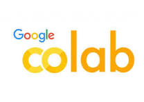

<style scoped>{font-size: 2.6em;}</style>
<!-- _footer : "" -->
<!-- _class: lead -->

# 🧪 Laboratorio
## Notebook en Google Colab


---
<style scoped>{font-size: 3em;}</style>
<!-- _footer : "" -->
<!-- _class: invert -->

# 🧪 Laboratorio
## Trabajaremos en 

<div class='card'>

- **Primero:** Necesitas una cuenta en Google

- **Segundo:** abrir colab
https://colab.research.google.com/


- **Tercero:** Descargar archivo desde *SIVEDUC*
[`semana_08_primer_notebook.ipynb`](https://siveducmd.uach.cl/mod/resource/view.php?id=1098055)

- **Cuarto:**  Guardar una copia en *Google Drive*
</div>

---

<!-- _class: lab -->

# Nivel 1 · Fundamentos

**Ej. 1:** Variables, tipos, área basal y relación H/D de un árbol
**Ej. 2:** Strings + ASCII — codificar "PUDU" en binario

---

<!-- _class: lab -->

# Nivel 2 · Condicionales

**Ej. 3:** Clasificador UICN completo (if/elif/else + anidados)
**Ej. 4:** Decisión de muestreo con `and`, `or`, `not`

---

<!-- _class: lab -->

# Nivel 3 · Bucles

**Ej. 5:** Abundancias relativas de 5 especies con `for`
**Ej. 6:** Filtrar DAPs grandes con `for` + `if` + acumulación

---

<!-- _class: lab -->

# Desafío · Shannon $H'$ automático

```python
import math
abundancias = [45, 28, 67, 12, 33, 8, 52]
total = sum(abundancias)

H = 0
for n in abundancias:
    p = n / total
    H -= p * math.log(p)

print(f"H' = {H:.4f} nats")
```

*En la Sem. 3 calcularon H para 3 especies a mano. Ahora lo hacen para 7, o 700, con 5 líneas.*

---

# Lo que aprendimos hoy

| Concepto | Sección 1 | Python |
|---|---|---|
| Celda de memoria | Sem. 1: celda numerada | `variable = valor` |
| Codificación | Sem. 2: ASCII, tipos | `int`, `float`, `str`, `bool` |
| Decisión | Sem. 4: rombo del flujo | `if / elif / else` |
| Repetición | Sem. 4: pasadas del sort | `for` / `while` |
| Acumulación | Sem. 3: contar especies | `total += n` |

---

# Próxima semana

## Semana 9 · Colecciones: listas y diccionarios

*Una variable guarda un dato. ¿Y si necesitan guardar 100 especies? Van a usar una lista.* 

*¿Y asociar cada especie con su abundancia? Un diccionario — la tabla de frecuencias de la Semana 3.*

---

<!-- _class: lead -->
<!-- _paginate: false -->

# ¿Preguntas?
